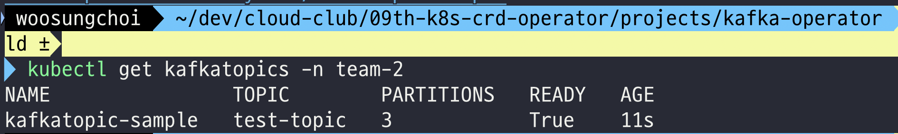
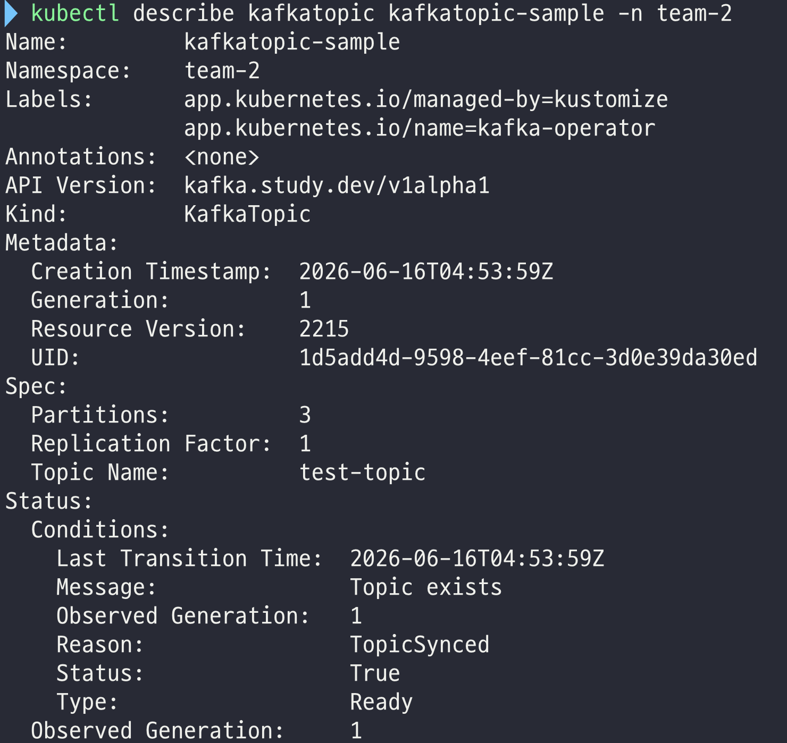
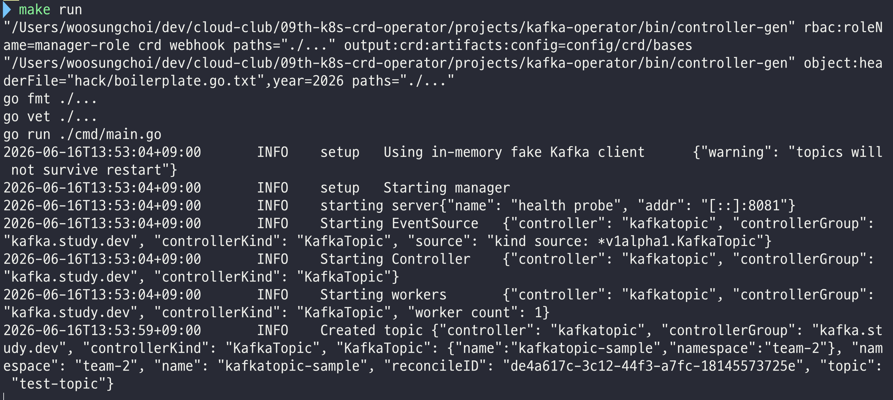

# 작업 진행 기록

## 1주차 작업

| 항목 | 한줄 설명 |
|---|---|
| 문서 정리 | 계획서·인터페이스 합의서·클러스터 룰을 `docs/`로 통합 (kebab-case) |
| 공유 클러스터 룰 반영 | API group을 `kafka.study.dev`, 운영 namespace를 `team-2`로 통일 |
| 프로젝트 스캐폴딩 | kubebuilder v4.14.0으로 `KafkaTopic` (namespaced, `v1alpha1`) 초기화 |
| CRD Spec/Status 정의 | topicName / partitions / replicationFactor / config + conditions / observedGeneration / observedPartitions |
| Validation 마커 | topicName·replicationFactor immutable, partitions·replicationFactor min=1, topicName 패턴/길이 제약 |
| Printer columns | `kubectl get`에 Topic / Partitions / Ready / Age 노출 |
| Kafka Client 인터페이스 | `internal/kafka/interface.go` — `kafka.Client` + TopicInfo/TopicSpec + sentinel 에러 4종 |
| Fake Client | `internal/kafka/fake/fake.go` — goroutine-safe in-memory 구현, Seed/Names 헬퍼 포함 |
| Manager namespace scope | `cmd/main.go`에 `--watch-namespace` 플래그(기본 `team-2`)와 cache 제한 |
| 기본 Reconcile | DescribeTopic → 없으면 CreateTopic, Ready Condition + observed 필드 갱신 |
| KafkaUnreachable 처리 | Ready=False / Reason=KafkaUnreachable + `RequeueAfter` 30초 |
| Controller test 보강 | scaffolded test에 valid Spec + fake.Client 주입, 토픽 생성 검증 |

---

## 프로젝트 스캐폴딩

```bash
   kubebuilder init \
     --domain study.dev \
     --repo github.com/cloud-club/09th-k8s-crd-operator/projects/kafka-operator

   kubebuilder create api \
     --group kafka \
     --version v1alpha1 \
     --kind KafkaTopic
   ```
   → API Group은 `kafka.study.dev` 가 된다 (`--group` + `--domain`).

---

## CRD 정의

### `api/v1alpha1/kafkatopic_types.go`

``` go
package v1alpha1

import (
	metav1 "k8s.io/apimachinery/pkg/apis/meta/v1"
)

// KafkaTopicSpec defines the desired state of KafkaTopic.
type KafkaTopicSpec struct {
	// TopicName is the actual topic name in Kafka.
	// Must match Kafka's naming rules: 1-249 chars of [a-zA-Z0-9._-]. Immutable.
	// +kubebuilder:validation:MinLength=1
	// +kubebuilder:validation:MaxLength=249
	// +kubebuilder:validation:Pattern=`^[a-zA-Z0-9._-]+$`
	// +kubebuilder:validation:XValidation:rule="self == oldSelf",message="topicName is immutable"
	// +required
	TopicName string `json:"topicName"`

	// Partitions is the desired partition count.
	// Kafka does not allow partition decrease; the controller surfaces such
	// attempts via the Ready=False / PartitionDecreaseNotAllowed condition
	// rather than rejecting them at admission.
	// +kubebuilder:validation:Minimum=1
	// +required
	Partitions int32 `json:"partitions"`

	// ReplicationFactor is the number of broker replicas per partition. Immutable.
	// Changing the replication factor requires kafka-reassign-partitions and is out of scope.
	// +kubebuilder:validation:Minimum=1
	// +kubebuilder:validation:XValidation:rule="self == oldSelf",message="replicationFactor is immutable"
	// +required
	ReplicationFactor int16 `json:"replicationFactor"`

	// Config holds topic-level Kafka configuration overrides (e.g. retention.ms).
	// Only keys present here are managed by the operator; absent keys keep Kafka defaults.
	// +optional
	Config map[string]string `json:"config,omitempty"`
}

// KafkaTopicStatus defines the observed state of KafkaTopic.
type KafkaTopicStatus struct {
	// Conditions represent the latest observations of the KafkaTopic state.
	// Standard types:
	//   - Ready: the topic is in sync with Kafka
	//   - ConfigDrifted: spec.config diverges from the live Kafka config (week 2)
	// +listType=map
	// +listMapKey=type
	// +optional
	Conditions []metav1.Condition `json:"conditions,omitempty"`

	// ObservedGeneration is the .metadata.generation last processed by the controller.
	// +optional
	ObservedGeneration int64 `json:"observedGeneration,omitempty"`

	// ObservedPartitions is the partition count observed in Kafka at the last reconcile.
	// +optional
	ObservedPartitions int32 `json:"observedPartitions,omitempty"`
}

// +kubebuilder:object:root=true
// +kubebuilder:subresource:status
// +kubebuilder:printcolumn:name="Topic",type=string,JSONPath=`.spec.topicName`
// +kubebuilder:printcolumn:name="Partitions",type=integer,JSONPath=`.spec.partitions`
// +kubebuilder:printcolumn:name="Ready",type=string,JSONPath=`.status.conditions[?(@.type=="Ready")].status`
// +kubebuilder:printcolumn:name="Age",type=date,JSONPath=`.metadata.creationTimestamp`

// KafkaTopic is the Schema for the kafkatopics API.
type KafkaTopic struct {
	metav1.TypeMeta `json:",inline"`

	// metadata is a standard object metadata
	// +optional
	metav1.ObjectMeta `json:"metadata,omitzero"`

	// spec defines the desired state of KafkaTopic
	// +required
	Spec KafkaTopicSpec `json:"spec"`

	// status defines the observed state of KafkaTopic
	// +optional
	Status KafkaTopicStatus `json:"status,omitzero"`
}

// +kubebuilder:object:root=true

// KafkaTopicList contains a list of KafkaTopic.
type KafkaTopicList struct {
	metav1.TypeMeta `json:",inline"`
	metav1.ListMeta `json:"metadata,omitzero"`
	Items           []KafkaTopic `json:"items"`
}

func init() {
	SchemeBuilder.Register(&KafkaTopic{}, &KafkaTopicList{})
}

```

작성 후 `make manifests`로 yaml 자동 생성, `make generate`로 deepcopy 자동 생성.

---

## Interface, Mock 작성

### Interface: `internal/kafka/interface.go`

```go
package kafka

import (
	"context"
	"errors"
	"fmt"
)

// Sentinel errors. Wrappers may add context but must Unwrap to one of these
// so callers can branch on errors.Is.
var (
	// ErrTopicNotFound is returned when the target topic does not exist.
	ErrTopicNotFound = errors.New("kafka: topic not found")

	// ErrTopicAlreadyExists is returned by CreateTopic when the topic exists.
	ErrTopicAlreadyExists = errors.New("kafka: topic already exists")

	// ErrKafkaUnreachable indicates the broker could not be reached
	// (network, auth, timeout). Callers typically Requeue.
	ErrKafkaUnreachable = errors.New("kafka: broker unreachable")

	// ErrPartitionDecrease indicates an attempt to lower the partition count,
	// which Kafka does not allow. Concrete attempts return PartitionDecreaseError
	// which Unwraps to this sentinel.
	ErrPartitionDecrease = errors.New("kafka: partition decrease not allowed")
)

// PartitionDecreaseError carries the current and desired partition counts.
// Recover via errors.As; check the sentinel via errors.Is(err, ErrPartitionDecrease).
type PartitionDecreaseError struct {
	Current int32
	Desired int32
}

func (e *PartitionDecreaseError) Error() string {
	return fmt.Sprintf("kafka: cannot decrease partitions from %d to %d", e.Current, e.Desired)
}

func (e *PartitionDecreaseError) Unwrap() error { return ErrPartitionDecrease }

// TopicInfo is the observed state of a Kafka topic returned by DescribeTopic.
// Config contains the full set of effective configuration keys reported by
// Kafka (overrides + defaults); callers compare only the keys they manage.
type TopicInfo struct {
	Name              string
	Partitions        int32
	ReplicationFactor int16
	Config            map[string]string
}

// TopicSpec is the input to CreateTopic.
type TopicSpec struct {
	Name              string
	Partitions        int32
	ReplicationFactor int16
	Config            map[string]string
}

// Client is the domain abstraction over Kafka admin operations.
//
// Method contracts:
//
//   - DescribeTopic returns ErrTopicNotFound when the topic does not exist.
//   - CreateTopic returns ErrTopicAlreadyExists when the topic exists.
//   - DeleteTopic returns ErrTopicNotFound when the topic does not exist;
//     callers convert to nil for finalizer idempotency.
//   - UpdateConfig overrides only the supplied keys (incremental AlterConfigs);
//     keys absent from the map are left untouched.
//   - AddPartitions raises the total partition count; equal is a noop;
//     lower returns *PartitionDecreaseError.
//
// All methods may return ErrKafkaUnreachable when the broker is unreachable.
// Implementations must be safe for concurrent use.
type Client interface {
	DescribeTopic(ctx context.Context, name string) (*TopicInfo, error)
	CreateTopic(ctx context.Context, spec TopicSpec) error
	DeleteTopic(ctx context.Context, name string) error
	UpdateConfig(ctx context.Context, name string, config map[string]string) error
	AddPartitions(ctx context.Context, name string, total int32) error
}
```

### Mock: `internal/kafka/fake/fake.go`

```go
package fake

import (
	"context"
	"maps"
	"sort"
	"sync"

	"github.com/cloud-club/09th-k8s-crd-operator/projects/kafka-operator/internal/kafka"
)

// Client is a goroutine-safe, in-memory kafka.Client.
type Client struct {
	mu     sync.Mutex
	topics map[string]*kafka.TopicInfo
}

// New returns an empty fake client.
func New() *Client {
	return &Client{topics: make(map[string]*kafka.TopicInfo)}
}

// DescribeTopic implements kafka.Client.
func (c *Client) DescribeTopic(_ context.Context, name string) (*kafka.TopicInfo, error) {
	c.mu.Lock()
	defer c.mu.Unlock()
	t, ok := c.topics[name]
	if !ok {
		return nil, kafka.ErrTopicNotFound
	}
	return cloneTopic(t), nil
}

// CreateTopic implements kafka.Client.
func (c *Client) CreateTopic(_ context.Context, spec kafka.TopicSpec) error {
	c.mu.Lock()
	defer c.mu.Unlock()
	if _, exists := c.topics[spec.Name]; exists {
		return kafka.ErrTopicAlreadyExists
	}
	c.topics[spec.Name] = &kafka.TopicInfo{
		Name:              spec.Name,
		Partitions:        spec.Partitions,
		ReplicationFactor: spec.ReplicationFactor,
		Config:            maps.Clone(spec.Config),
	}
	return nil
}

// DeleteTopic implements kafka.Client.
func (c *Client) DeleteTopic(_ context.Context, name string) error {
	c.mu.Lock()
	defer c.mu.Unlock()
	if _, ok := c.topics[name]; !ok {
		return kafka.ErrTopicNotFound
	}
	delete(c.topics, name)
	return nil
}

// UpdateConfig implements kafka.Client. Only the supplied keys are overridden;
// existing keys not present in the map are left untouched.
func (c *Client) UpdateConfig(_ context.Context, name string, config map[string]string) error {
	c.mu.Lock()
	defer c.mu.Unlock()
	t, ok := c.topics[name]
	if !ok {
		return kafka.ErrTopicNotFound
	}
	if t.Config == nil {
		t.Config = make(map[string]string, len(config))
	}
	for k, v := range config {
		t.Config[k] = v
	}
	return nil
}

// AddPartitions implements kafka.Client.
func (c *Client) AddPartitions(_ context.Context, name string, total int32) error {
	c.mu.Lock()
	defer c.mu.Unlock()
	t, ok := c.topics[name]
	if !ok {
		return kafka.ErrTopicNotFound
	}
	if total < t.Partitions {
		return &kafka.PartitionDecreaseError{Current: t.Partitions, Desired: total}
	}
	t.Partitions = total
	return nil
}

// Names returns the sorted set of stored topic names. Test helper.
func (c *Client) Names() []string {
	c.mu.Lock()
	defer c.mu.Unlock()
	out := make([]string, 0, len(c.topics))
	for k := range c.topics {
		out = append(out, k)
	}
	sort.Strings(out)
	return out
}

// Seed inserts a topic directly, bypassing CreateTopic. Test helper.
func (c *Client) Seed(t kafka.TopicInfo) {
	c.mu.Lock()
	defer c.mu.Unlock()
	c.topics[t.Name] = &kafka.TopicInfo{
		Name:              t.Name,
		Partitions:        t.Partitions,
		ReplicationFactor: t.ReplicationFactor,
		Config:            maps.Clone(t.Config),
	}
}

func cloneTopic(t *kafka.TopicInfo) *kafka.TopicInfo {
	return &kafka.TopicInfo{
		Name:              t.Name,
		Partitions:        t.Partitions,
		ReplicationFactor: t.ReplicationFactor,
		Config:            maps.Clone(t.Config),
	}
}

// Compile-time check that *Client satisfies kafka.Client.
var _ kafka.Client = (*Client)(nil)

```

---

## `main.go` 수정하기

### `cmd/main.go`

- main에서 controller를 생성할 때, Interface의 껍데기만 구현한 fake 객체를 주입해준다.

```go
kafkaClient := fake.New()
	setupLog.Info("Using in-memory fake Kafka client", "warning", "topics will not survive restart")

	if err := (&controller.KafkaTopicReconciler{
		Client: mgr.GetClient(),
		Scheme: mgr.GetScheme(),
		Kafka:  kafkaClient,
	}).SetupWithManager(mgr); err != nil {
		setupLog.Error(err, "Failed to create controller", "controller", "kafkatopic")
		os.Exit(1)
	}
```

- 네임스페이스 설정

```go
var watchNamespace string
	
	flag.StringVar(&watchNamespace, "watch-namespace", "team-2",
		"Namespace the controller watches for KafkaTopic resources. "+
			"Defaults to the shared-cluster convention for team-2.")

// ...

mgr, err := ctrl.NewManager(ctrl.GetConfigOrDie(), ctrl.Options{
		Scheme:                 scheme,
		Metrics:                metricsServerOptions,
		WebhookServer:          webhookServer,
		HealthProbeBindAddress: probeAddr,
		LeaderElection:         enableLeaderElection,
		LeaderElectionID:       "9393e56f.study.dev",
		// Restrict the controller's cache to a single namespace.
		// The CRD is cluster-scoped but per docs/cluster-rules.md each team
		// only manages resources in its own namespace.
		Cache: cache.Options{
			DefaultNamespaces: map[string]cache.Config{
				watchNamespace: {},
			},
		},	
```

## Controller 구현

### `internal/controller/kafkatopic_controller.go`

```go
package controller

import (
	"context"
	"errors"
	"time"

	"k8s.io/apimachinery/pkg/api/meta"
	metav1 "k8s.io/apimachinery/pkg/apis/meta/v1"
	"k8s.io/apimachinery/pkg/runtime"
	ctrl "sigs.k8s.io/controller-runtime"
	"sigs.k8s.io/controller-runtime/pkg/client"
	logf "sigs.k8s.io/controller-runtime/pkg/log"

	kafkav1alpha1 "github.com/cloud-club/09th-k8s-crd-operator/projects/kafka-operator/api/v1alpha1"
	"github.com/cloud-club/09th-k8s-crd-operator/projects/kafka-operator/internal/kafka"
)

// Condition types and reasons surfaced on KafkaTopic.status.conditions.
const (
	conditionReady = "Ready"

	reasonTopicSynced      = "TopicSynced"
	reasonKafkaUnreachable = "KafkaUnreachable"

	requeueOnUnreachable = 30 * time.Second
)

// KafkaTopicReconciler reconciles a KafkaTopic object.
type KafkaTopicReconciler struct {
	client.Client
	Scheme *runtime.Scheme
	Kafka  kafka.Client
}

// +kubebuilder:rbac:groups=kafka.study.dev,resources=kafkatopics,verbs=get;list;watch;create;update;patch;delete
// +kubebuilder:rbac:groups=kafka.study.dev,resources=kafkatopics/status,verbs=get;update;patch
// +kubebuilder:rbac:groups=kafka.study.dev,resources=kafkatopics/finalizers,verbs=update

// Reconcile drives a single KafkaTopic toward its desired state.
//
// Week 1 scope: create the topic in Kafka if absent; surface result via the
// Ready condition and ObservedGeneration / ObservedPartitions. Drift,
// partition resizing, and finalizer-based deletion land in week 2.
func (r *KafkaTopicReconciler) Reconcile(ctx context.Context, req ctrl.Request) (ctrl.Result, error) {
	log := logf.FromContext(ctx)

	var kt kafkav1alpha1.KafkaTopic
	if err := r.Get(ctx, req.NamespacedName, &kt); err != nil {
		return ctrl.Result{}, client.IgnoreNotFound(err)
	}

	info, descErr := r.Kafka.DescribeTopic(ctx, kt.Spec.TopicName)
	switch {
	case errors.Is(descErr, kafka.ErrTopicNotFound):
		if err := r.Kafka.CreateTopic(ctx, toTopicSpec(&kt)); err != nil {
			if errors.Is(err, kafka.ErrKafkaUnreachable) {
				return r.markUnreachable(ctx, &kt, err)
			}
			log.Error(err, "CreateTopic failed", "topic", kt.Spec.TopicName)
			return ctrl.Result{}, err
		}
		log.Info("Created topic", "topic", kt.Spec.TopicName)
		return r.markReady(ctx, &kt, "Topic created", kt.Spec.Partitions)

	case errors.Is(descErr, kafka.ErrKafkaUnreachable):
		return r.markUnreachable(ctx, &kt, descErr)

	case descErr != nil:
		return ctrl.Result{}, descErr

	default:
		// Topic exists. Drift handling lands in week 2.
		return r.markReady(ctx, &kt, "Topic exists", info.Partitions)
	}
}

func (r *KafkaTopicReconciler) markReady(
	ctx context.Context, kt *kafkav1alpha1.KafkaTopic, message string, observedPartitions int32,
) (ctrl.Result, error) {
	meta.SetStatusCondition(&kt.Status.Conditions, metav1.Condition{
		Type:               conditionReady,
		Status:             metav1.ConditionTrue,
		Reason:             reasonTopicSynced,
		Message:            message,
		ObservedGeneration: kt.Generation,
	})
	kt.Status.ObservedGeneration = kt.Generation
	kt.Status.ObservedPartitions = observedPartitions
	return ctrl.Result{}, r.Status().Update(ctx, kt)
}

func (r *KafkaTopicReconciler) markUnreachable(
	ctx context.Context, kt *kafkav1alpha1.KafkaTopic, cause error,
) (ctrl.Result, error) {
	meta.SetStatusCondition(&kt.Status.Conditions, metav1.Condition{
		Type:               conditionReady,
		Status:             metav1.ConditionFalse,
		Reason:             reasonKafkaUnreachable,
		Message:            cause.Error(),
		ObservedGeneration: kt.Generation,
	})
	kt.Status.ObservedGeneration = kt.Generation
	if err := r.Status().Update(ctx, kt); err != nil {
		return ctrl.Result{}, err
	}
	return ctrl.Result{RequeueAfter: requeueOnUnreachable}, nil
}

func toTopicSpec(kt *kafkav1alpha1.KafkaTopic) kafka.TopicSpec {
	return kafka.TopicSpec{
		Name:              kt.Spec.TopicName,
		Partitions:        kt.Spec.Partitions,
		ReplicationFactor: kt.Spec.ReplicationFactor,
		Config:            kt.Spec.Config,
	}
}

// SetupWithManager sets up the controller with the Manager.
func (r *KafkaTopicReconciler) SetupWithManager(mgr ctrl.Manager) error {
	return ctrl.NewControllerManagedBy(mgr).
		For(&kafkav1alpha1.KafkaTopic{}).
		Named("kafkatopic").
		Complete(r)
}

```

---

## 테스트 

### 방법

- `make test`
- `make test-e2e`
- kind로 로컬 테스트
    - controller를 호스트에서 실행
    - controller를 클러스터에 pod로 띄우기

### kind로 로컬 테스트 - controller를 호스트에서 실행

#### 1. 테스트용 클러스터 생성

`kind create cluster --name kafka-op`

#### 2. `team-2` 네임스페이스 생성

`kubectl create namespace team-2`

#### 3. CR 생성을 위한 yaml 작성

`config/sample/kafka_v1alpha1_kafkatopic.yaml`

```yaml
apiVersion: kafka.study.dev/v1alpha1
kind: KafkaTopic
metadata:
  labels:
    app.kubernetes.io/name: kafka-operator
    app.kubernetes.io/managed-by: kustomize
  name: kafkatopic-sample
spec:
  topicName: "test-topic"
  partitions: 3
  replicationFactor: 1
```

#### 4. `make install`로 api server에 CRD 등록

#### 5. `make run`으로 호스트에서 컨트롤러 실행
가볍고 빠름, 개발용으로 권장

#### 6. CR 적용
`kubectl apply -f config/samples/kafka_v1alpha1_kafkatopic.yaml -n team-2`


- CR 적용 후 get을 통해 확인해보면 오브젝트가 잘 떠있다.


- desired state가 잘 반영되어있다.


- controller 로그를 보면 CR 적용 후 Created topic이 찍힌다.

#### 7. 테스트 후 정리
  `make uninstall`로 CRD 제거
  `kind delete cluster --name kafka-op`로 클러스터 삭제

#### 참고: 다른 테스트 방법

controller를 클러스터 안에 Pod으로 배포 (실배포 시나리오)
- 1-2번 동일 (kind 생성 + team-2 namespace)
- 이미지 빌드
    - `make docker-build IMG=kafka-operator:dev`
- kind에 이미지 로드 (kind는 자체 컨테이너 안에서 돌아서 호스트 docker 이미지가 안 보임)
    - `kind load docker-image kafka-operator:dev --name kafka-op`
- CRD + Deployment 배포
    - `make deploy IMG=kafka-operator:dev`
    - → CRD + namespace + RBAC + Deployment 모두 적용
- Pod 확인
    - `kubectl get pods -n kafka-operator-system`
- 샘플 CR + 관찰 (방법 A와 동일)

- 정리
    - `make undeploy`
    - `kind delete cluster --name kafka-op`
    - 작동 원리: 진짜 운영처럼 controller가 Pod으로 떠 있음. 코드 수정 시 이미지 재빌드 → re-load → re-deploy. 느리지만 RBAC/Deployment manifest 자체를 같이 검증.

`make test-e2e`는 위의 방법을 코드로 자동화한 것. Makefile에 이미 정의돼 있음 (90번 라인)
  1. kind 클러스터 kafka-operator-test-e2e 생성 (없으면)
  2. 이미지 빌드 + 로드 + 배포
  3. test/e2e/의 Ginkgo 테스트 실행 (-tags=e2e 빌드 태그로 일반 빌드와 분리)
  4. 끝나면 cluster 삭제

---

## 2주차 예정 (project-plan.md 기준)

| 항목 | 한줄 설명 |
|---|---|
| Drift 감지 | spec.config vs 실제 Kafka config 비교 → `ConfigDrifted` Condition + 자동 수정 |
| Partition 증가 | spec.partitions 증가 반영, 감소 시 `PartitionDecreaseNotAllowed` Condition |
| Finalizer | CR 삭제 시 Kafka 토픽 정리, 멱등 처리 |
| 클러스터 배포 | 이미지 빌드/푸시 + `make deploy`로 가비아 클러스터 시연 |
| 발표 자료 | README, 시연 시나리오, 발표 슬라이드 |
