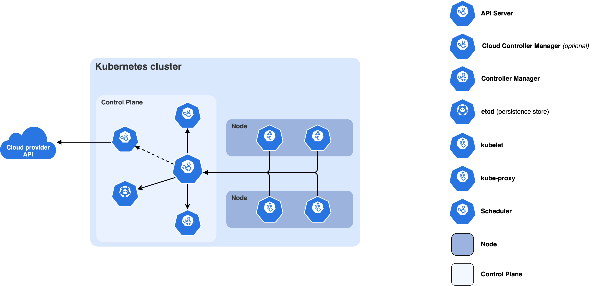

# Week 1 - Kubernetes 구조 이해 및 CRD 개념

---

## 사전 지식

### 1. 컨테이너(Container) 기초

Kubernetes는 **컨테이너 오케스트레이션** 시스템이다. Kubernetes를 이해하려면 컨테이너 개념이 선행되어야 한다.

**컨테이너란?**

- 애플리케이션과 그 실행 환경(라이브러리, 설정 등)을 하나로 묶은 **격리된 실행 단위**
- VM(가상머신)과 달리 OS 커널을 공유하여 훨씬 가볍고 빠름
- Linux의 **cgroups**(리소스 격리)와 **namespaces**(프로세스/네트워크/파일시스템 격리) 기술 기반

```
VM 방식                         컨테이너 방식
┌──────────┬──────────┐        ┌──────────┬──────────┐
│  App A   │  App B   │        │  App A   │  App B   │
├──────────┼──────────┤        ├──────────┼──────────┤
│ Guest OS │ Guest OS │        │  Libs    │  Libs    │
├──────────┴──────────┤        ├──────────┴──────────┤
│     Hypervisor      │        │  Container Runtime  │
├─────────────────────┤        ├─────────────────────┤
│      Host OS        │        │      Host OS        │
└─────────────────────┘        └─────────────────────┘
```

**컨테이너 이미지**

- 컨테이너 실행에 필요한 파일 시스템 스냅샷 (레이어 구조)
- `nginx:1.21`, `postgres:15` 처럼 이름:태그 형식으로 식별
- Docker Hub, ECR, GCR 등의 이미지 레지스트리에 저장

---

### 2. REST API 기초

API Server와의 모든 통신은 **REST API** 방식으로 이루어진다.

**REST API란?**

- HTTP 프로토콜을 이용해 리소스를 CRUD 방식으로 다루는 아키텍처
- URL이 리소스를 나타내고, HTTP 메서드가 행위를 나타냄


| HTTP 메서드 | 행위    | Kubernetes 예시   |
| -------- | ----- | --------------- |
| `GET`    | 조회    | Pod 목록 조회       |
| `POST`   | 생성    | 새 Deployment 생성 |
| `PUT`    | 전체 수정 | 리소스 전체 교체       |
| `PATCH`  | 부분 수정 | replicas 수 변경   |
| `DELETE` | 삭제    | Pod 삭제          |


**Kubernetes API 경로 구조**

```
https://<api-server>:<port>/apis/<group>/<version>/namespaces/<namespace>/<resource>/<name>

예시:
GET  /api/v1/namespaces/default/pods                  # Pod 목록
GET  /api/v1/namespaces/default/pods/my-pod           # 특정 Pod
POST /apis/apps/v1/namespaces/default/deployments     # Deployment 생성
```

---

### 3. YAML 문법 기초

Kubernetes의 모든 리소스는 **YAML** 형식으로 정의된다.

```yaml
# 기본 구조
key: value                   # 문자열
number: 42                   # 숫자
boolean: true                # 불리언

nested:                      # 중첩 객체
  child: value

list:                        # 리스트
  - item1
  - item2

# Kubernetes 리소스의 공통 구조
apiVersion: apps/v1          # API 그룹/버전
kind: Deployment             # 리소스 종류
metadata:                    # 메타데이터 (이름, 네임스페이스, 레이블 등)
  name: my-app
  namespace: default
  labels:
    app: my-app
spec:                        # 원하는 상태 (Desired State)
  replicas: 3
status:                      # 현재 상태 (컨트롤러가 기록, 사용자가 직접 설정 X)
  availableReplicas: 3
```

---

### 4. 분산 시스템 기초 개념

**합의 알고리즘 (Raft)**

- etcd가 사용하는 분산 합의 알고리즘
- 여러 노드 중 과반수(quorum)가 동의해야 데이터 변경 확정
- etcd 클러스터를 홀수(3, 5, 7)개로 구성하는 이유

```
etcd 클러스터 (3노드)
┌────────┐    ┌────────┐    ┌────────┐
│ Leader │◄──►│Follower│◄──►│Follower│
│        │    │        │    │        │
└────────┘    └────────┘    └────────┘
    쓰기 요청        복제         복제
    (과반수 동의 필요: 3개 중 2개)
```

**Watch 패턴**

Kubernetes의 모든 컴포넌트(Scheduler, Controller, kubelet)는 API Server를 **Watch**하여 리소스 변경을 감지한다.

- Polling(주기적 조회) 대신 **이벤트 기반**으로 변경 사항을 실시간 수신 → 불필요한 API 호출 없음
- HTTP의 **Long Polling(청크 스트리밍)** 방식으로 구현 (`GET /api/v1/pods?watch=true`)
- 이벤트 타입: `ADDED`, `MODIFIED`, `DELETED`
- 각 이벤트에는 변경된 리소스의 전체 오브젝트가 포함됨
- `resourceVersion` 필드를 이용해 마지막으로 받은 시점 이후의 변경만 수신 가능 (재연결 시 유실 방지)

```
컴포넌트 (Scheduler, Controller 등)
    │
    │  GET /api/v1/pods?watch=true&resourceVersion=12345
    │  "Pod 리소스 변경되면 스트리밍으로 알려줘"
    ▼
API Server (HTTP 연결 유지)
    │
    │  etcd에서 변경 이벤트 발생 시 즉시 전송
    │
    ├─ {"type": "ADDED",    "object": {...새 Pod...}}
    ├─ {"type": "MODIFIED", "object": {...업데이트된 Pod...}}
    └─ {"type": "DELETED",  "object": {...삭제된 Pod...}}
    ▼
컴포넌트 (이벤트 타입에 따라 동작 수행)
    │
    ├─ ADDED   → 새 리소스 처리 (예: Scheduler가 노드 할당)
    ├─ MODIFIED → 변경 사항 반영 (예: Controller가 Reconcile 수행)
    └─ DELETED → 정리 작업 수행 (예: Controller가 연관 리소스 삭제)
```

**왜 Polling 대신 Watch인가?**

```
Polling 방식 (비효율적)          Watch 방식 (효율적)
컴포넌트                         컴포넌트
  │  "변경됐어?" (1초마다)           │  Watch 등록 (한 번)
  ▼                               ▼
API Server                      API Server
  │  "아니"                         │
  │  "아니"                         │  (변경 발생 시)
  │  "아니"                         ├─→ 즉시 이벤트 전송
  │  "변경됨!"                      │
```

→ 클러스터 규모가 커질수록 Watch 방식의 효율 차이가 극명하게 드러남

---

### 5. 네임스페이스(Namespace) 개념

Kubernetes에서 리소스를 논리적으로 격리하는 단위.

```bash
# 기본 네임스페이스
kubectl get namespaces

# NAME              STATUS
# default           Active    # 기본 네임스페이스 (지정 안 하면 여기 생성)
# kube-system       Active    # 시스템 컴포넌트 (kube-dns, kube-proxy 등)
# kube-public       Active    # 공개 읽기 가능 리소스
# kube-node-lease   Active    # 노드 하트비트용
```

- **Namespaced 리소스**: Pod, Deployment, Service 등 → 특정 네임스페이스에 속함
- **Cluster 리소스**: Node, PersistentVolume, CRD 등 → 네임스페이스 없이 클러스터 전체에 속함

---

## 1. Kubernetes Control Plane 구성요소

### 전체 구조

Kubernetes 클러스터는 크게 **Control Plane**과 **Worker Node**로 나뉜다.

```
┌─────────────────────────────────────────────┐
│               Control Plane                 │
│                                             │
│  ┌─────────────┐   ┌──────┐   ┌──────────┐  │
│  │ kube-       │   │ etcd │   │  kube-   │  │
│  │ apiserver   │◄─►│      │   │ scheduler│  │
│  └──────┬──────┘   └──────┘   └──────────┘  │
│         │                                   │
│  ┌──────▼──────────────────────────────┐    │
│  │        kube-controller-manager      │    │
│  └─────────────────────────────────────┘    │
└─────────────────────────────────────────────┘
           │
┌──────────▼─────────────────────────────────┐
│               Worker Node                  │
│                                            │
│  ┌────────┐  ┌──────────┐  ┌───────────┐   │
│  │kubelet │  │kube-proxy│  │ Container │   │
│  │        │  │          │  │  Runtime  │   │
│  └────────┘  └──────────┘  └───────────┘   │
└────────────────────────────────────────────┘
```





---

### 1-1. kube-apiserver (API Server)

> 공식 문서: "The API server is a component of the Kubernetes control plane that exposes the Kubernetes API. The API server is the front end for the Kubernetes control plane."

**핵심 역할**

- Kubernetes API를 외부에 노출하는 **Control Plane의 프론트엔드**
- 모든 컴포넌트(kubectl, scheduler, controller, kubelet)가 반드시 API Server를 통해 통신
- 요청에 대한 **인증(Authentication) → 인가(Authorization) → Admission Control → Validation** 수행
- etcd에 데이터를 읽고 쓰는 유일한 컴포넌트
- 수평 확장(horizontal scaling) 가능 - 여러 인스턴스를 띄워 트래픽 분산

**주요 특징**

- RESTful API 제공 (`/api/v1`, `/apis/apps/v1` 등)
- Watch 메커니즘 제공 → 리소스 변경 사항을 다른 컴포넌트가 실시간으로 감지 가능
- OpenAPI 스펙 자동 생성 (`/openapi/v2`, `/openapi/v3`)

---

### 1-2. etcd

> Kubernetes 공식 문서: "Consistent and highly-available key value store used as Kubernetes' backing store for all cluster data."
>
> etcd 공식 문서: "etcd is designed as a general substrate for large scale distributed systems. etcd stores metadata in a consistent and fault-tolerant way."

**이름의 유래**

> etcd 공식 문서: "The name 'etcd' originated from two ideas, the unix '/etc' folder and 'distributed' systems. The '/etc' folder is a place to store configuration data for a single system whereas etcd stores configuration information for large scale distributed systems. Hence, a 'distributed /etc' is 'etcd'."

- Unix의 `/etc` (단일 시스템 설정 저장소) + **d**istributed = **etcd**
- 단일 서버의 `/etc` 폴더가 하는 일을 분산 시스템 규모로 확장한 것

---

**핵심 역할**

- Kubernetes 클러스터의 **모든 상태 데이터를 저장하는 단일 진실의 원천(Single Source of Truth)**
- 분산 Key-Value 저장소 (Raft 합의 알고리즘 기반)
- API Server만이 etcd에 직접 접근 (다른 컴포넌트는 API Server를 통해 간접 접근)

**저장 데이터 예시**

- Pod, Deployment, Service 등 모든 리소스의 Spec 및 Status
- RBAC 정책, ConfigMap, Secret
- 네임스페이스 정보, 노드 등록 정보

**Key 경로 구조 예시**

```
/registry/pods/default/my-pod
/registry/deployments/default/my-deployment
/registry/services/specs/default/my-service
/registry/configmaps/default/my-config
```

---

**MVCC (Multi-Version Concurrency Control) 데이터 모델**

> etcd 공식 문서: "etcd stores data in a multiversion persistent key-value store. The persistent key-value store preserves the previous version of a key-value pair when its value is superseded with new data."

etcd는 단순히 현재 값만 저장하는 게 아니라 **모든 변경 이력을 버전별로 보존**한다.

- 키를 수정해도 이전 값이 삭제되지 않고 이전 revision에 그대로 남음
- `compaction`으로 오래된 revision을 명시적으로 정리하기 전까지 과거 데이터 접근 가능
- Kubernetes Watch 패턴의 "끊긴 watch 재연결 시 유실 방지"가 이 MVCC 덕분에 가능

```
revision 1: /registry/pods/default/nginx → {image: "nginx:1.20"}
revision 2: /registry/pods/default/nginx → {image: "nginx:1.21"}   ← 수정
revision 3: /registry/pods/default/nginx → {image: "nginx:1.22"}   ← 수정

# 현재 값 조회
etcdctl get /registry/pods/default/nginx
→ nginx:1.22 (revision 3)

# 과거 revision 조회 (time travel query)
etcdctl get /registry/pods/default/nginx --rev=1
→ nginx:1.20 (revision 1 시점의 값)
```

---

**Revision 개념**

> etcd 공식 문서: "Each atomic mutative operation creates a new revision on the key space. The revision can be used as a logical clock for key value store."

- 클러스터 생성 시 revision = 1 에서 시작
- 데이터를 변경하는 모든 연산(Put, Delete, Txn)은 **단조 증가하는 전역 revision 번호**를 부여받음
- revision은 클러스터 전체의 **논리적 시계(Logical Clock)** 역할
- 더 큰 revision을 가진 키-값 쌍은 더 나중에 수정된 것

```
클러스터 시작
  revision=1

Pod 생성 (revision=2)
  /registry/pods/default/nginx → version=1, revision=2

Deployment 생성 (revision=3)
  /registry/deployments/default/my-app → version=1, revision=3

Pod 업데이트 (revision=4)
  /registry/pods/default/nginx → version=2, revision=4
                                  ↑ key 자체의 변경 횟수
```

---

**API 보장 (Guarantees)**

> etcd 공식 문서: "etcd ensures the strongest consistency and durability guarantees for a distributed system."

| 보장 | 설명 |
|------|------|
| **Durability** (내구성) | 완료된 연산은 영구 저장. 읽기 시 항상 내구성이 보장된 데이터만 반환 |
| **Linearizability** (선형성) | 쓰기 완료 후 읽기 시 항상 최신 값 반환. Raft 합의 과정을 거쳐 보장 |
| **Atomicity** (원자성) | 모든 요청은 전부 성공하거나 전부 실패. 부분 완료 없음 |
| **Watch Ordered** | Watch 이벤트는 revision 순서대로 전달 (순서 역전 없음) |
| **Watch Reliable** | 이벤트 누락 없음. a < b < c 순서 중 a와 c를 받으면 b도 반드시 수신 |
| **Watch Resumable** | 연결 끊김 후 마지막으로 받은 revision부터 재개 가능 (MVCC 덕분) |

---

**클러스터 구성 및 Quorum**

> etcd 공식 문서: "etcd is designed as a general substrate for large scale distributed systems. These are systems that will never tolerate split-brain operation."

etcd는 **Split-Brain**(네트워크 분할로 인해 클러스터가 둘로 나뉘어 각자 독립적으로 동작하는 상태)을 절대 허용하지 않는다. 이를 위해 Raft 알고리즘의 **과반수 동의(Quorum)** 방식을 사용한다.

```
클러스터 크기별 내결함성
┌──────────────┬──────────────┬────────────────────────┐
│ 클러스터 노드 수  │ Quorum (과반수) │ 허용 가능한 장애 노드 수       │
├──────────────┼──────────────┼────────────────────────┤
│      1       │      1       │          0             │
│      2       │      2       │          0             │
│      3       │      2       │          1  ← 권장 최소  │
│      5       │      3       │          2             │
│      7       │      4       │          3             │
└──────────────┴──────────────┴────────────────────────┘
```

- 짝수 노드(2, 4, 6)는 홀수 노드 대비 내결함성이 증가하지 않아 **비효율적** → 홀수로 구성
- 프로덕션에서는 **3노드 또는 5노드** 권장
- etcd 공식 문서 권장 최대 DB 크기: **수 GB** (대용량 데이터 저장에는 부적합)

---

**물리적 저장 구조**

> etcd 공식 문서: "etcd stores the physical data as key-value pairs in a persistent b+tree. etcd also keeps a secondary in-memory btree index to speed up range queries over keys."

```
쓰기 요청 (Put /foo = "bar")
        │
        ▼
  Raft 합의 (Leader → Follower 복제 → 과반수 동의)
        │
        ▼
  영구 B+Tree (디스크)
  key: (revision, sub, type) → value: delta 저장
        │
        ▼
  인메모리 B-Tree 인덱스 (범위 조회 가속)
  key: 사용자 키 → pointer: B+Tree의 위치
```

- **영구 B+Tree**: revision 기반 key로 delta(변경분)만 저장 → 디스크 효율적
- **인메모리 B-Tree**: 사용자 키로 빠른 범위 조회(range query) 지원
- `etcdctl compact <revision>`: 지정 revision 이전 데이터 정리 → 스토리지 확보

---

> **운영 주의사항**: 공식 문서에서 강조하듯, 프로덕션 환경에서는 반드시 etcd 데이터 백업 계획이 필요하다.
> ([etcd 백업 가이드](https://kubernetes.io/docs/tasks/administer-cluster/configure-upgrade-etcd/#backing-up-an-etcd-cluster))

---

### 1-3. kube-scheduler

> 공식 문서: "Control plane component that watches for newly created Pods with no assigned node, and selects a node for them to run on."

**핵심 역할**

- 새로 생성된 Pod 중 **아직 노드에 배치되지 않은 Pod**를 감지하고 적합한 노드를 선택
- API Server의 Watch 메커니즘으로 미할당 Pod를 지속적으로 감시

**스케줄링 결정 요소 (공식 문서 기준)**


| 분류            | 예시                           |
| ------------- | ---------------------------- |
| 리소스 요구사항      | CPU/Memory requests & limits |
| 하드웨어/소프트웨어 제약 | nodeSelector, nodeName       |
| 어피니티/안티-어피니티  | podAffinity, nodeAffinity    |
| 데이터 지역성       | 특정 스토리지가 있는 노드 선호            |
| 워크로드 간섭       | 특정 Pod들이 같은 노드에 있지 않도록       |
| 마감기한          | Priority, Preemption         |


**스케줄링 프로세스**

```
새 Pod 감지 (Watch)
      ↓
Filtering (불가한 노드 제거)
  - 리소스 부족 노드 제거
  - NodeSelector 불일치 노드 제거
  - Taint/Toleration 불일치 노드 제거
      ↓
Scoring (적합한 노드 점수 계산)
  - 리소스 균형 점수
  - 어피니티 점수
  - 기타 플러그인 점수
      ↓
최고 점수 노드 선택 → Pod의 spec.nodeName 필드에 바인딩
```

---

### 1-4. kube-controller-manager

> 공식 문서: "Control plane component that runs controller processes."

**핵심 역할**

- 여러 내장 컨트롤러들을 하나의 프로세스에서 실행
- 각 컨트롤러는 **Desired State와 Current State를 지속적으로 비교하고 조정**

**주요 내장 컨트롤러**


| 컨트롤러                      | 역할                                      |
| ------------------------- | --------------------------------------- |
| Node controller           | 노드 장애 감지 및 대응                           |
| Job controller            | Job 오브젝트 감시 후 Pod 생성하여 태스크 완료           |
| EndpointSlice controller  | Service와 Pod 간 연결 (EndpointSlice 객체 관리) |
| ServiceAccount controller | 새 네임스페이스의 기본 ServiceAccount 생성          |
| ReplicaSet controller     | 지정된 수의 Pod 복제본 유지                       |
| Deployment controller     | 롤링 업데이트, 롤백 관리                          |


---

## 2. 요청 흐름: kubectl → API Server → etcd

### 전체 흐름 도식

```
사용자
  │
  │  kubectl apply -f deployment.yaml
  ▼
kubectl (클라이언트)
  │ HTTP(S) 요청
  │ PATCH /apis/apps/v1/namespaces/default/deployments/my-app
  ▼
kube-apiserver
  │
  ├─ 1. 인증 (Authentication)
  │    - 인증서, Bearer Token, ServiceAccount Token 등 검증
  │
  ├─ 2. 인가 (Authorization)
  │    - RBAC 정책 확인 (이 사용자가 Deployment를 create/update할 수 있는가?)
  │
  ├─ 3. Admission Control
  │    - MutatingAdmissionWebhook (값 자동 설정, 기본값 주입)
  │    - ValidatingAdmissionWebhook (유효성 최종 검증)
  │
  ├─ 4. Object 유효성 검증 (스키마 검증)
  │
  ├─ 5. etcd 저장
  │    - /registry/deployments/default/my-app 에 저장
  │
  └─ 6. 클라이언트에 응답 반환 (201 Created 또는 200 OK)

etcd에 저장 완료 후 →

kube-controller-manager (Deployment controller)
  │  Watch로 새 Deployment 이벤트 감지
  ├─ ReplicaSet 생성 요청 → API Server → etcd 저장
  └─ ReplicaSet controller가 Pod 생성 요청

kube-scheduler
  │  Watch로 미할당 Pod 감지
  └─ 적합한 노드 선택 → Pod spec.nodeName 업데이트 → API Server → etcd 저장

kubelet (해당 노드)
  │  Watch로 자신의 노드에 바인딩된 Pod 감지
  └─ 컨테이너 런타임에 컨테이너 생성 요청 → Pod Status 업데이트 → API Server
```

### 예시: `kubectl apply -f nginx-deployment.yaml` 실행 시

```yaml
# nginx-deployment.yaml
apiVersion: apps/v1
kind: Deployment
metadata:
  name: nginx-deployment
  namespace: default
spec:
  replicas: 3
  selector:
    matchLabels:
      app: nginx
  template:
    metadata:
      labels:
        app: nginx
    spec:
      containers:
      - name: nginx
        image: nginx:1.21
        ports:
        - containerPort: 80
```

1. `kubectl apply` → API Server로 Deployment 오브젝트 전송
2. API Server가 검증 후 etcd에 저장
3. Deployment Controller가 변경 감지 → ReplicaSet 생성
4. ReplicaSet Controller가 3개의 Pod 오브젝트 생성 (etcd에 저장)
5. Scheduler가 미할당 Pod 3개 감지 → 각각 노드 할당
6. 각 노드의 kubelet이 Pod 감지 → containerd/CRI-O로 nginx 컨테이너 실행

---

## 3. 선언형 시스템 (Declarative System)

### 3-1. Desired State vs Current State

Kubernetes의 핵심 철학은 **선언형(Declarative) 관리**다.


| 개념                 | 설명                            |
| ------------------ | ----------------------------- |
| **Desired State**  | 사용자가 YAML로 선언한 "원하는 상태"       |
| **Current State**  | 클러스터에 실제로 존재하는 현재 상태          |
| **Reconciliation** | 컨트롤러가 두 상태의 차이를 감지하고 일치시키는 과정 |


> 공식 문서: "The Kubernetes declarative API enforces a separation of responsibilities. You declare the desired state of your resource. The Kubernetes controller keeps the current state of Kubernetes objects in sync with your declared desired state."

### 3-2. 선언형 vs 명령형 비교

**명령형(Imperative) 접근 방식**

```bash
# "이걸 해라"고 명령
kubectl run nginx --image=nginx --replicas=3
kubectl scale deployment nginx --replicas=5
kubectl set image deployment/nginx nginx=nginx:1.22
```

**선언형(Declarative) 접근 방식**

```bash
# "이 상태가 되어야 한다"고 선언
kubectl apply -f nginx-deployment.yaml
# YAML에 replicas: 5로 바꾼 후 다시 apply
kubectl apply -f nginx-deployment.yaml
```

### 3-3. 선언형 시스템의 장점

```
사용자 YAML (Desired State)          실제 클러스터 (Current State)
┌──────────────────────────┐         ┌──────────────────────────┐
│ replicas: 3              │         │ Running Pods: 2          │
│ image: nginx:1.21        │   ≠     │ image: nginx:1.21        │
│ ...                      │         │ ...                      │
└──────────────────────────┘         └──────────────────────────┘
                     │                         │
                     └──────────┬──────────────┘
                                ▼
                        Controller (Reconcile Loop)
                        "Pod가 1개 부족하다 → 1개 생성"
```

**자가 치유(Self-Healing)**

- Pod가 죽으면 컨트롤러가 자동으로 새 Pod 생성
- 노드 장애 시 다른 노드에 Pod 재스케줄링

**멱등성(Idempotent)**

- 같은 YAML을 여러 번 `apply` 해도 결과는 동일
- 차이가 없으면 아무 작업도 하지 않음

**버전 관리 친화적**

- YAML 파일을 Git으로 관리 → GitOps 패턴의 기반

---

## 4. CRD (Custom Resource Definition) 개념

### 4-1. Built-in Resource vs Custom Resource

> 공식 문서: "A resource is an endpoint in the Kubernetes API that stores a collection of API objects of a certain kind; for example, the built-in pods resource contains a collection of Pod objects."

**Built-in Resource (기본 제공 리소스)**


| API Group            | 리소스 예시                                    | 경로                               |
| -------------------- | ----------------------------------------- | -------------------------------- |
| core (v1)            | Pod, Service, ConfigMap, PersistentVolume | `/api/v1/...`                    |
| apps/v1              | Deployment, StatefulSet, DaemonSet        | `/apis/apps/v1/...`              |
| batch/v1             | Job, CronJob                              | `/apis/batch/v1/...`             |
| networking.k8s.io/v1 | Ingress, NetworkPolicy                    | `/apis/networking.k8s.io/v1/...` |


**Custom Resource (사용자 정의 리소스)**

- 기본 설치에는 없는, 특정 클러스터에 추가된 Kubernetes API 확장
- CRD를 등록하면 자동으로 새로운 RESTful API 엔드포인트 생성
- kubectl로 기본 리소스처럼 조작 가능 (`kubectl get`, `kubectl apply`, `kubectl delete` 등)

**예시: Prometheus Operator의 CRD**

```bash
# CRD 등록 후 아래처럼 사용 가능
kubectl get prometheus
kubectl get servicemonitor
kubectl get prometheusrule
```

### 4-2. CRD가 필요한 이유

> 공식 문서: "A custom resource is an extension of the Kubernetes API that is not necessarily available in a default Kubernetes installation. It represents a customization of a particular Kubernetes installation."

**시나리오: 데이터베이스 클러스터 관리**

CRD 없이:

```bash
# 복잡한 스크립트와 절차적 코드 필요
kubectl create deployment postgres-master --image=postgres
kubectl create service clusterip postgres-master --tcp=5432:5432
kubectl create deployment postgres-replica --image=postgres
# ... 수십 개의 kubectl 명령어 필요
```

CRD + Operator 방식:

```yaml
# PostgreSQL 클러스터를 단일 YAML로 선언
apiVersion: acid.zalan.do/v1
kind: postgresql
metadata:
  name: my-postgres-cluster
spec:
  teamId: "myteam"
  volume:
    size: 10Gi
  numberOfInstances: 3
  users:
    myapp: [superuser, createdb]
  databases:
    myapp: myapp
  postgresql:
    version: "15"
```

**CRD 도입 효과**

- Kubernetes의 선언형 관리 모델을 커스텀 인프라에도 적용
- kubectl, RBAC, 감사 로그 등 Kubernetes 생태계 기능을 그대로 활용
- Custom Controller(Operator)와 결합하여 복잡한 운영 로직 자동화

---

## 5. CRD YAML 구조 - spec / status 분리

### 5-1. CRD 정의 YAML 기본 구조

공식 문서 예시 (`crontabs.stable.example.com` CRD):

```yaml
apiVersion: apiextensions.k8s.io/v1       # CRD 전용 API 그룹
kind: CustomResourceDefinition
metadata:
  # 반드시 "<plural>.<group>" 형식
  name: crontabs.stable.example.com
spec:
  # REST API 경로에 사용: /apis/<group>/<version>
  group: stable.example.com

  versions:
    - name: v1
      served: true      # 이 버전을 API Server가 서빙할지 여부
      storage: true     # etcd에 저장할 버전 (단 하나만 true)
      schema:
        openAPIV3Schema:
          type: object
          properties:
            spec:
              type: object
              properties:
                cronSpec:
                  type: string
                image:
                  type: string
                replicas:
                  type: integer
            status:
              type: object
              properties:
                phase:
                  type: string

  scope: Namespaced     # 또는 Cluster

  names:
    plural: crontabs    # URL에 사용: /apis/.../crontabs
    singular: crontab   # CLI 표시용
    kind: CronTab       # 리소스 kind (CamelCase)
    shortNames:
    - ct                # kubectl get ct 처럼 축약 사용 가능
```

### 5-2. spec / status 분리 (Subresource)

> 공식 문서: "Allows fine-grained access control where user writes the spec section and the controller writes the status section."

**분리 원칙**


| 필드       | 작성 주체    | 의미                       |
| -------- | -------- | ------------------------ |
| `spec`   | **사용자**  | 원하는 상태(Desired State) 선언 |
| `status` | **컨트롤러** | 현재 상태(Current State) 보고  |


**status subresource 활성화**

```yaml
versions:
  - name: v1
    served: true
    storage: true
    subresources:
      status: {}          # status를 별도 서브리소스로 분리
    schema:
      openAPIV3Schema:
        type: object
        properties:
          spec:
            type: object
            properties:
              cronSpec:
                type: string
              image:
                type: string
              replicas:
                type: integer
          status:
            type: object
            properties:
              availableReplicas:
                type: integer
              phase:
                type: string
                enum: [Pending, Running, Failed, Succeeded]
```

**분리 활성화 시 동작 방식**

```bash
# 사용자: spec 수정 (일반 update)
kubectl apply -f my-crontab.yaml

# 컨트롤러: status만 업데이트 (별도 엔드포인트)
# PUT /apis/stable.example.com/v1/namespaces/default/crontabs/my-cron/status
```

**status subresource 분리의 이점**

- 사용자가 `kubectl apply`로 status를 임의로 덮어쓰는 사고 방지
- 컨트롤러가 status만 업데이트할 때 spec 변경으로 인한 불필요한 reconcile 루프 방지
- RBAC으로 spec 수정 권한과 status 수정 권한을 별도 부여 가능

### 5-3. Custom Resource 오브젝트 예시

CRD 등록 후 실제 리소스를 생성하는 YAML:

```yaml
apiVersion: "stable.example.com/v1"       # CRD에서 정의한 group/version
kind: CronTab                              # CRD에서 정의한 kind
metadata:
  name: my-new-cron-object
  namespace: default
spec:                                      # 사용자가 선언하는 Desired State
  cronSpec: "* * * * */5"
  image: my-awesome-cron-image
  replicas: 2
# status는 컨트롤러가 작성 (사용자가 직접 설정 X)
```

```bash
# 등록된 CRD 조회
kubectl get crd
# crontabs.stable.example.com   2024-01-01T00:00:00Z

# Custom Resource 조회 (다양한 방식 모두 지원)
kubectl get crontab
kubectl get crontabs
kubectl get ct            # shortName 사용
```

---

## 6. API 확장 방식 비교: CRD vs API Aggregation

> 공식 문서: "Kubernetes provides two ways to add custom resources to your cluster: CRDs are simple and can be created without any programming. API Aggregation requires programming, but allows more control over API behaviors like how data is stored and conversion between API versions."

### 6-1. CRD (CustomResourceDefinition)

**동작 방식**

- CRD를 등록하면 메인 API Server가 해당 리소스의 CRUD를 자동으로 처리
- 별도의 API Server 없이 kube-apiserver가 직접 서빙
- etcd에 데이터 저장

```
클라이언트
    │
    ▼
kube-apiserver
    │  (CRD로 등록된 리소스도 직접 처리)
    ▼
etcd
```

**특징**

- 프로그래밍 불필요 (YAML 작성만으로 등록)
- 추가 서비스 운영 불필요
- OpenAPI v3.0 스키마 기반 유효성 검증
- kubectl 완전 지원

### 6-2. API Aggregation (AA)

**API Aggregation이란?**

> 공식 문서: "The aggregation layer allows you to provide specialized implementations for your custom resources by writing and deploying your own API server. The main API server delegates requests to your API server for the custom resources that you handle, making them available to all of its clients."

Kubernetes API를 확장하는 두 번째 방법으로, **별도의 API Server를 직접 개발하여** 메인 kube-apiserver 뒤에 붙이는 방식이다. 사용자 입장에서는 기존 Kubernetes API와 동일하게 사용할 수 있지만 실제로는 요청이 Extension API Server로 위임(proxy)된다. CRD보다 복잡하지만 스토리지 백엔드 커스터마이징, Protocol Buffers 지원 등 훨씬 자유로운 구현이 가능하다.

**동작 방식**

- 별도의 Extension API Server를 직접 구현하고 배포
- kube-apiserver가 해당 API 요청을 프록시로 Extension API Server에 위임

```
클라이언트
    │
    ▼
kube-apiserver (프록시 역할)
    │  /apis/metrics.k8s.io/v1beta1/* 요청 감지
    ▼
Extension API Server (별도 Deployment로 운영)
    │
    ▼
자체 스토리지 (etcd 이외 가능)
```

**실제 사례: Metrics Server**

```bash
kubectl top nodes    # metrics.k8s.io API 사용
kubectl top pods
```

→ `metrics.k8s.io/v1beta1` API 그룹이 별도 Metrics Server로 구현된 대표적인 AA 사례

### 6-3. CRD vs API Aggregation 비교


| 항목                    | CRD            | API Aggregation               |
| --------------------- | -------------- | ----------------------------- |
| 구현 난이도                | 쉬움 (YAML만 작성)  | 어려움 (API Server 직접 개발)        |
| 추가 서비스                | 불필요            | 별도 Deployment 운영 필요           |
| 스토리지                  | etcd 고정        | 자유롭게 선택 가능 (time-series DB 등) |
| 검증(Validation)        | OpenAPI v3 스키마 | 완전 자유로운 커스텀 로직                |
| Protocol Buffers 지원   | 미지원            | 지원                            |
| strategic-merge-patch | 미지원            | 지원                            |
| 다중 버전 변환(Conversion)  | Webhook 필요     | 직접 구현 가능                      |
| 커스텀 스토리지 로직           | 불가             | 가능                            |
| 기타 서브리소스 (/logs 등)    | 불가             | 가능                            |


**공식 문서의 선택 기준 요약**

> "CRDs are easier to use. Aggregated APIs are more flexible. Choose the method that best meets your needs."

- **CRD 선택** → 필드 수가 적고, 사내 프로젝트 또는 소규모 오픈소스, Operator 패턴 구현 시
- **API Aggregation 선택** → 특수 스토리지 백엔드 필요, Protocol Buffers 필요, 완전한 커스텀 API 서버 제어가 필요한 상업적 제품

---

## 정리 요약

```
Kubernetes 전체 흐름

kubectl apply -f desired.yaml
        │
        ▼
   API Server  ←──────────────── 유일한 etcd 접근자
   (인증/인가/검증)
        │
        ▼
      etcd (모든 상태 저장)
        │
        ▼ (Watch 이벤트)
   ┌────┴──────────┬─────────────┐
   ▼               ▼             ▼
Scheduler    Controller     kubelet
(노드 할당)  (상태 조정)    (컨테이너 실행)


선언형 시스템의 핵심
- Desired State (spec) ≠ Current State (status)
  → Controller가 자동으로 일치시킴 (Reconciliation Loop)


CRD = Kubernetes API 확장 메커니즘
- Built-in Resource: Pod, Deployment, Service ...
- Custom Resource: CRD 등록으로 추가
  → spec (사용자 선언) / status (컨트롤러 보고) 분리
  → Custom Controller(Operator)와 결합 시 완전한 선언형 API
```

---

## 참고 공식 문서

- [Kubernetes Components](https://kubernetes.io/docs/concepts/overview/components/)
- [Cluster Architecture](https://kubernetes.io/docs/concepts/architecture/)
- [kube-scheduler](https://kubernetes.io/docs/concepts/scheduling-eviction/kube-scheduler/)
- [Controllers](https://kubernetes.io/docs/concepts/architecture/controller/)
- [Custom Resources](https://kubernetes.io/docs/concepts/api-extension/custom-resources/)
- [Extend the Kubernetes API with CustomResourceDefinitions](https://kubernetes.io/docs/tasks/extend-kubernetes/custom-resources/custom-resource-definitions/)
- [API Aggregation Layer](https://kubernetes.io/docs/concepts/extend-kubernetes/api-extension/apiserver-aggregation/)
- [etcd official docs](https://etcd.io/docs/)

