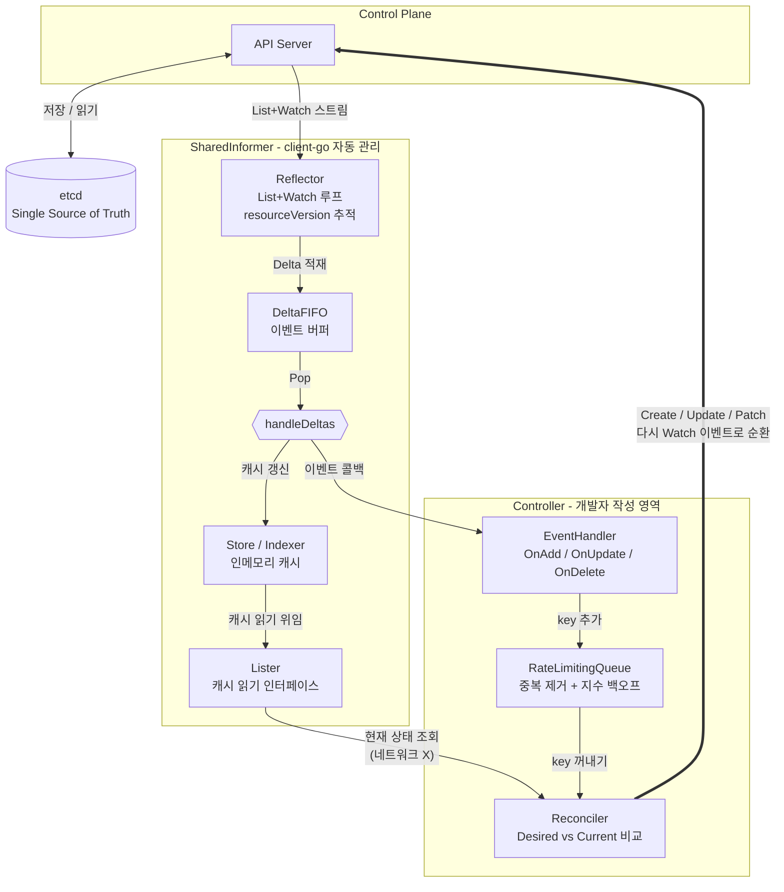

# Week 2 - Kubernetes Controller 패턴과 Reconciliation

---

## 사전 지식

### 1. kubeconfig

`kubectl`이나 `client-go`가 API Server와 통신할 때 사용하는 **인증·연결 정보 파일**이다.  
기본 위치는 `~/.kube/config`이며, `KUBECONFIG` 환경 변수로 경로를 변경할 수 있다.

```yaml
apiVersion: v1
kind: Config
clusters:
  - name: my-cluster
    cluster:
      server: https://127.0.0.1:6443          # API Server 주소
      certificate-authority-data: <base64>    # API Server CA 인증서

users:
  - name: admin
    user:
      client-certificate-data: <base64>       # 클라이언트 인증서
      client-key-data: <base64>               # 클라이언트 개인키

contexts:
  - name: my-context
    context:
      cluster: my-cluster
      user: admin
      namespace: default

current-context: my-context                   # 현재 활성 컨텍스트
```

**kubeconfig 구성 요소**


| 요소                | 역할                             |
| ----------------- | ------------------------------ |
| `clusters`        | 접속할 API Server의 주소와 CA 인증서     |
| `users`           | 인증 자격증명 (인증서, 토큰 등)            |
| `contexts`        | cluster + user + namespace의 조합 |
| `current-context` | 현재 활성화된 context 이름             |


**out-of-cluster vs in-cluster 인증**

Controller를 어디에서 실행하느냐에 따라 API Server에 접근하는 방법이 달라진다.

- **out-of-cluster**: Controller가 **클러스터 외부**(개발자 로컬 환경, CI 서버 등)에서 실행된다. 클러스터 안에 있지 않으므로 `~/.kube/config` 파일에 저장된 인증서·토큰으로 API Server에 접근한다.
- **in-cluster**: Controller가 **클러스터 내부 Pod로** 배포되어 실행된다. Kubernetes가 Pod 실행 시 ServiceAccount 토큰과 CA 인증서를 자동으로 주입하므로, 별도의 kubeconfig 파일 없이도 API Server에 접근할 수 있다. 실제 운영 환경에서 Controller를 배포할 때의 표준 방식이다.

```
out-of-cluster (로컬 개발 환경)
  → ~/.kube/config 파일에서 자격증명 로드
  → client-go: clientcmd.BuildConfigFromFlags("", kubeconfig)

in-cluster (Pod 내부에서 실행)
  → ServiceAccount 토큰: /var/run/secrets/kubernetes.io/serviceaccount/token
  → CA 인증서: /var/run/secrets/kubernetes.io/serviceaccount/ca.crt
  → client-go: rest.InClusterConfig()
```

```go
// out-of-cluster: 로컬 kubeconfig 사용
config, err := clientcmd.BuildConfigFromFlags("", filepath.Join(homedir.HomeDir(), ".kube", "config"))

// in-cluster: Pod 내부 ServiceAccount 토큰 자동 사용
config, err := rest.InClusterConfig()
```

---

### 2. client-go 라이브러리 소개

`client-go`는 Go 언어로 Kubernetes API Server와 통신하기 위한 **공식 클라이언트 라이브러리**다.  
`kubectl`, kube-scheduler, kube-controller-manager 모두 내부적으로 `client-go`를 사용한다.

```bash
# 프로젝트에 client-go 추가
go get k8s.io/client-go@latest
```

**주요 패키지 구성**


| 패키지              | 역할                                              |
| ---------------- | ----------------------------------------------- |
| `kubernetes`     | Built-in 리소스(Pod, Deployment 등) 조작 Clientset    |
| `tools/cache`    | Informer, Reflector, Store, Lister 등 컨트롤러 핵심 도구 |
| `util/workqueue` | 중복 제거 큐, Rate Limiting 큐                        |
| `rest`           | 저수준 HTTP 클라이언트                                  |
| `dynamic`        | 런타임에 타입을 결정하는 동적 클라이언트                          |


---

### 3. Go context 패키지

`context`는 API 호출, 고루틴 간 **취소 신호와 데드라인**을 전달하는 표준 패키지다.  
`client-go`의 모든 API 호출은 첫 번째 인자로 `context.Context`를 받는다.

```go
// 기본 컨텍스트 (취소 없음)
ctx := context.Background()

// 명시적으로 취소 가능한 컨텍스트
ctx, cancel := context.WithCancel(context.Background())
defer cancel() // 함수 종료 시 반드시 호출 → 고루틴 누수 방지

// 타임아웃 컨텍스트 (5초)
ctx, cancel := context.WithTimeout(context.Background(), 5*time.Second)
defer cancel()

// 취소 전파 예시
pods, err := clientset.CoreV1().Pods("default").List(ctx, metav1.ListOptions{})
```

---

## 1. Desired State / Current State 심화

### 1-1. resourceVersion과 generation

> 아래 필드들은 **kubeconfig에 저장되지 않는다.** kubeconfig는 클러스터 접속(인증·주소) 정보만 담고, `resourceVersion`·`generation`·`observedGeneration`은 각 리소스의 `metadata`/`status`에 **etcd**에 저장된다.

**resourceVersion**

> 공식 문서: "Every Kubernetes object has a resourceVersion field representing the version of that resource as stored in the underlying persistence layer."

- etcd에서 해당 오브젝트를 마지막으로 저장한 **revision 번호**다
- 오브젝트의 spec이든 status든 **어떤 필드든 변경**될 때마다 갱신된다 ( 증가된다 )
- Watch 메커니즘이 "어디서부터 이벤트를 받을지" 결정하는 **기준점** 역할

```yaml
metadata:
  name: nginx-deployment
  resourceVersion: "84932"    # etcd에 마지막 저장된 revision
  generation: 3               # spec이 변경된 횟수
```

**예시: spec 변경 vs status 변경**

```bash
# 1) 조회 시점
kubectl get deploy nginx-deployment -o jsonpath='{.metadata.resourceVersion}{"\n"}{.metadata.generation}{"\n"}'
# 84932
# 3

# 2) spec 변경 (replicas 3 → 5)
kubectl scale deploy nginx-deployment --replicas=5
# resourceVersion: 84933  ← 증가
# generation: 4          ← spec 변경이므로 +1

# 3) Controller가 status만 갱신 (readyReplicas 등)
# resourceVersion: 84934  ← status만 바뀌어도 증가
# generation: 4          ← spec은 그대로이므로 유지
```

**generation vs observedGeneration**

> 공식 API Conventions: "generation is an integer maintained by the system to identify the change in spec. observedGeneration is the generation of the object a particular controller has seen and acted on."

- **`generation`**: 사용자(또는 상위 리소스)가 **spec을 바꿀 때마다** API Server가 +1 하는 “원하는 설정의 버전 번호”
- **`observedGeneration`**: Deployment Controller 등이 **Reconcile로 spec을 반영한 뒤** status에 적어 두는 “내가 처리 완료한 generation”

둘이 같으면 “최신 spec을 이미 반영했다”, 다르면 “아직 Reconcile이 따라가는 중”이다.  
(`resourceVersion`과 달리 **spec 변경 추적**에만 쓰이며, status만 바뀌어도 `generation`은 올라가지 않는다.)

| 필드                          | 작성 주체      | 의미                               |
| --------------------------- | ---------- | -------------------------------- |
| `metadata.generation`       | API Server | spec이 변경될 때마다 +1 증가              |
| `status.observedGeneration` | Controller | Controller가 마지막으로 처리한 generation |

**예시: scale 직후 → Controller 반영 완료**

```bash
# 1) replicas 3 → 5 로 변경 직후 (Controller가 아직 Pod를 늘리는 중)
kubectl get deploy nginx-deployment -o jsonpath='{.metadata.generation}{"\n"}{.status.observedGeneration}{"\n"}'
# 5    ← spec이 바뀌어 generation 증가
# 4    ← Controller는 아직 이전 generation(4)까지만 처리했다고 표시

# 2) 잠시 후 Reconcile 완료 (Pod 5개 ready 등)
# 5
# 5    ← observedGeneration이 generation과 같아짐 → 최신 spec 반영 완료
```

```
generation: 5, observedGeneration: 4   → 처리 중 (Progressing)
generation: 5, observedGeneration: 5   → 처리 완료 (Available 등과 함께 확인)
```

```go
// Reconcile 루프 안에서 아직 처리 안 된 spec 변경인지 확인
if deployment.Generation != deployment.Status.ObservedGeneration {
    // 아직 최신 spec을 처리 중 → 작업 진행
}
```

---

### 1-2. Status Condition 패턴

> 공식 API Conventions: "Conditions represent the latest available observations of a resource's current state."

오브젝트의 세부 상태를 나타내기 위해 `status.conditions` 배열을 사용한다.  
단순한 phase 문자열보다 **여러 상태를 동시에, 구조적으로** 표현할 수 있다.

```go
// Condition의 공통 필드 구조 (metav1.Condition)
type Condition struct {
    Type               string      // 상태 종류 (예: "Available", "Progressing", "Degraded")
    Status             ConditionStatus // "True" / "False" / "Unknown"
    ObservedGeneration int64       // 이 Condition이 관찰한 generation
    LastTransitionTime metav1.Time // 마지막으로 Status가 변경된 시각
    Reason             string      // 기계가 읽는 이유 코드 (CamelCase, 예: "ReplicaSetUpdated")
    Message            string      // 사람이 읽는 설명 (예: "Replica set updated to match spec")
}
```

**Deployment의 실제 Condition 예시**

```bash
kubectl describe deployment nginx-deployment
# Conditions:
#   Type           Status  Reason
#   ----           ------  ------
#   Available      True    MinimumReplicasAvailable
#   Progressing    True    NewReplicaSetAvailable
```

---

### 1-3. Level-triggered vs Edge-triggered

Kubernetes Controller 설계에서 가장 중요한 철학 중 하나다.

**Edge-triggered (엣지 트리거)**

```
이벤트가 발생한 순간(에지)에만 반응
→ 이벤트를 하나라도 놓치면 영구적으로 놓침

문제 시나리오:
1. Pod 삭제 이벤트 발생 (엣지)
2. Controller가 일시적으로 다운 → 이벤트 수신 못함
3. Controller 재시작 후에도 삭제된 Pod를 모름 → 복구 불가
```

**Level-triggered (레벨 트리거)**

```
현재 상태(레벨)를 항상 확인하고 원하는 상태와 비교
→ 이벤트를 놓쳐도 다음 Reconcile 시 현재 상태를 다시 확인하므로 자동 복구

Kubernetes 채택 이유:
1. Pod 삭제 이벤트를 놓침
2. Controller 재시작 후 현재 Pod 수를 조회
3. Desired=3, Current=2 → 차이 감지 → Pod 1개 생성
```

```
Level-triggered Reconcile 루프의 핵심 규칙:

"이벤트 자체를 처리하지 말고, 현재 상태를 조회한 뒤 Desired State와 비교하라"

Bad (Edge-triggered 방식):
  func Reconcile(event Event) {
      if event.Type == DELETED { createPod() }  // 이벤트에 의존
  }

Good (Level-triggered 방식):
  func Reconcile(key string) {
      current := getCurrentPods()               // 항상 현재 상태 조회
      if current < desired { createPod() }     // 상태 비교로 행동 결정
  }
```

---

## 2. Controller / Reconciliation Loop 상세

### 2-1. Reconcile 함수 구조

Controller의 핵심은 **Reconcile 함수** 하나다.  
Workqueue에서 처리할 오브젝트의 키(`namespace/name`)를 꺼내 아래 패턴으로 실행한다.

```go
// Reconcile 함수의 표준 패턴
func (c *Controller) reconcile(ctx context.Context, key string) error {
    namespace, name, err := cache.SplitMetaNamespaceKey(key)
    if err != nil {
        return err
    }

    // 1. 현재 상태 조회 (API Server가 아닌 캐시(Lister)에서 읽음)
    deployment, err := c.deploymentsLister.Deployments(namespace).Get(name)
    if errors.IsNotFound(err) {
        // 오브젝트가 이미 삭제됨 → 정리 작업 후 종료
        return nil
    }
    if err != nil {
        return err
    }

    // 2. Desired State와 Current State 비교
    desiredReplicas := *deployment.Spec.Replicas
    currentReplicas := deployment.Status.ReadyReplicas

    // 3. 차이가 있으면 조정 작업 수행
    if currentReplicas != desiredReplicas {
        // ... Pod 생성/삭제 등
    }

    // 4. Status 업데이트 (현재 상태를 etcd에 기록)
    deploymentCopy := deployment.DeepCopy()
    deploymentCopy.Status.ObservedGeneration = deployment.Generation
    _, err = c.client.AppsV1().Deployments(namespace).
        UpdateStatus(ctx, deploymentCopy, metav1.UpdateOptions{})
    return err
}
```

---

### 2-2. 멱등성(Idempotency) 보장

> 공식 Kubernetes Controller 설계 원칙: Reconcile 함수는 **같은 입력으로 몇 번 실행되어도 동일한 결과**가 나와야 한다.

왜 멱등성이 중요한가?

- Controller는 같은 키를 여러 번 Reconcile할 수 있다 (네트워크 오류, 재시작, Rate Limiting 등)
- Reconcile이 중간에 실패해도 다시 실행하면 올바른 상태로 수렴해야 한다

**멱등성을 깨는 코드와 올바른 코드**

```go
// Bad: 매번 새 리소스를 만들려 함 → 중복 생성 오류
func (c *Controller) reconcile(key string) error {
    _, err := c.client.CoreV1().ConfigMaps("default").Create(ctx, configMap, metav1.CreateOptions{})
    return err // 두 번째 실행 시 AlreadyExists 오류 발생
}

// Good: 존재하면 업데이트, 없으면 생성 (Create-or-Update 패턴)
func (c *Controller) reconcile(key string) error {
    existing, err := c.client.CoreV1().ConfigMaps("default").Get(ctx, name, metav1.GetOptions{})
    if errors.IsNotFound(err) {
        _, err = c.client.CoreV1().ConfigMaps("default").Create(ctx, configMap, metav1.CreateOptions{})
        return err
    }
    if err != nil {
        return err
    }
    // 이미 존재 → 업데이트
    updated := existing.DeepCopy()
    updated.Data = configMap.Data
    _, err = c.client.CoreV1().ConfigMaps("default").Update(ctx, updated, metav1.UpdateOptions{})
    return err
}
```

---

### 2-3. Finalizer 패턴

> 공식 문서: "Finalizers are namespaced keys that tell Kubernetes to wait until specific conditions are met before it fully deletes resources marked for deletion."

`kubectl delete`를 실행하면 즉시 삭제되지 않고, `metadata.deletionTimestamp`가 설정되어 **삭제 대기 상태**로 전환된다.  
Finalizer가 모두 제거된 후에야 오브젝트가 실제로 삭제된다.

```
사용자: kubectl delete myresource/foo
          │
          ▼
API Server: deletionTimestamp 설정 (실제 삭제 아직 X)
          │
          ▼
Controller: deletionTimestamp 감지 → 정리 작업 수행
  (외부 리소스 삭제, 연관 리소스 정리 등)
          │
          ▼
Controller: Finalizer 항목 제거
  patch: metadata.finalizers = []
          │
          ▼
API Server: finalizers가 비었으므로 오브젝트 실제 삭제
```

```go
const myFinalizer = "mycontroller.example.com/cleanup"

func (c *Controller) reconcile(ctx context.Context, obj *MyResource) error {
    // 삭제 중인지 확인
    if obj.DeletionTimestamp != nil {
        if containsString(obj.Finalizers, myFinalizer) {
            // 정리 작업 수행 (외부 리소스 삭제 등)
            if err := c.cleanupExternalResources(obj); err != nil {
                return err
            }
            // Finalizer 제거 → 실제 삭제 허용
            patch := []byte(`{"metadata":{"finalizers":null}}`)
            _, err := c.client.Patch(ctx, obj.Name, types.MergePatchType, patch, metav1.PatchOptions{})
            return err
        }
        return nil
    }

    // 정상 동작: Finalizer가 없으면 추가
    if !containsString(obj.Finalizers, myFinalizer) {
        patch := []byte(`{"metadata":{"finalizers":["` + myFinalizer + `"]}}`)
        _, err := c.client.Patch(ctx, obj.Name, types.MergePatchType, patch, metav1.PatchOptions{})
        return err
    }

    // ... 일반 Reconcile 로직
    return nil
}
```

---

### 2-4. Owner Reference와 가비지 컬렉션

> 공식 문서: "Owner references describe the relationships between objects in Kubernetes. The garbage collector uses owner references to determine when an object can be deleted."

부모 오브젝트가 삭제되면 자식 오브젝트도 자동으로 삭제(Cascade Delete)된다.

```go
// 자식 오브젝트(Pod)에 Owner Reference 설정
pod := &corev1.Pod{
    ObjectMeta: metav1.ObjectMeta{
        Name:      "child-pod",
        Namespace: parent.Namespace,
        OwnerReferences: []metav1.OwnerReference{
            {
                APIVersion:         "apps/v1",
                Kind:               "Deployment",
                Name:               parent.Name,
                UID:                parent.UID,
                Controller:         boolPtr(true),  // 이 Controller가 이 자식을 소유
                BlockOwnerDeletion: boolPtr(true),  // 부모 삭제 시 자식 삭제 대기
            },
        },
    },
}
```

```
Deployment (parent)
    │
    ├── ReplicaSet (ownerRef → Deployment)
    │       │
    │       └── Pod (ownerRef → ReplicaSet)
    │
    └── Deployment 삭제 시
          → ReplicaSet 자동 삭제
            → Pod 자동 삭제 (Cascading)
```

---

## 3. Watch / Event HTTP 메커니즘 (깊이)

> Week1에서 Watch가 Polling보다 효율적이고 이벤트 기반임을 다뤘다.
> 이번 주차에서는 HTTP 레벨에서 Watch가 **실제로 어떻게 동작**하는지 살펴본다.

### 3-1. List + Watch 패턴

Watch는 단독으로 시작하지 않는다. **반드시 List로 현재 상태를 먼저 동기화한 뒤 Watch를 시작**한다.

```
1. List 요청 (현재 상태 전체 스냅샷)
   GET /api/v1/namespaces/default/pods
   → 응답에 resourceVersion: "10245" 포함

2. Watch 요청 (해당 resourceVersion 이후 변경사항만 수신)
   GET /api/v1/namespaces/default/pods?watch=1&resourceVersion=10245
   → HTTP 연결 유지, 변경 발생 시 JSON 스트리밍
```

이 패턴을 **List-Watch** 또는 **List-then-Watch**라고 부른다.  
`client-go`의 `Reflector`가 이 패턴을 자동으로 구현한다.

---

### 3-2. Watch의 HTTP 구조 (Chunked Transfer Encoding)

Watch 응답은 일반 HTTP 응답과 다르다.  
`Transfer-Encoding: chunked`를 사용해 **연결을 끊지 않고 이벤트를 스트리밍**한다.

```
클라이언트                               API Server
    │                                       │
    │  GET /api/v1/pods?watch=1&            │
    │      resourceVersion=10245            │
    │ ─────────────────────────────────────►│
    │                                       │
    │  200 OK                               │
    │  Transfer-Encoding: chunked           │
    │  Content-Type: application/json       │
    │ ◄─────────────────────────────────────│
    │                                       │
    │  (etcd에서 Pod 생성 이벤트 발생)         │
    │ ◄─────────────────────────────────────│
    │  {"type":"ADDED","object":{...}}      │
    │                                       │
    │  (Pod 상태 변경 이벤트)                  │
    │ ◄─────────────────────────────────────│
    │  {"type":"MODIFIED","object":{...}}   │
    │                                       │
    │  (연결 유지 중 ... 이벤트가 올 때만 전송)  │
```

각 Watch 이벤트의 JSON 구조:

```json
{
  "type": "MODIFIED",
  "object": {
    "kind": "Pod",
    "apiVersion": "v1",
    "metadata": {
      "name": "nginx-pod",
      "resourceVersion": "11020"
    },
    "spec": { ... },
    "status": { ... }
  }
}
```

**Watch 이벤트 타입**


| 타입         | 의미                                           |
| ---------- | -------------------------------------------- |
| `ADDED`    | 새 오브젝트 생성 (또는 Watch 재연결 후 기존 오브젝트 재전송)       |
| `MODIFIED` | 오브젝트 변경 (spec, status, metadata 무관하게 어떤 필드든) |
| `DELETED`  | 오브젝트 삭제 (삭제 직전 마지막 상태 포함)                    |
| `BOOKMARK` | `resourceVersion` 체크포인트 (오브젝트 변경 아님)         |
| `ERROR`    | Watch 스트림 오류 (주로 410 Gone)                   |


---

### 3-3. resourceVersion과 재연결 처리

**410 Gone - 히스토리 만료**

etcd는 기본적으로 최근 5분간의 변경 이력만 보관한다.  
오래된 `resourceVersion`으로 Watch를 요청하면 API Server가 `410 Gone`을 반환한다.

```
Watch 요청 (오래된 resourceVersion)
    │
    ▼
API Server
    │  {"type":"ERROR","object":{"kind":"Status","code":410,"reason":"Expired",...}}
    │
    ▼
클라이언트 처리 방법:
  1. 로컬 캐시 초기화
  2. 새로운 List 요청으로 전체 상태 재동기화
  3. 응답의 새 resourceVersion으로 Watch 재시작
```

**BOOKMARK 이벤트**

```
GET /api/v1/pods?watch=1&resourceVersion=10245&allowWatchBookmarks=true
```

`BOOKMARK`는 오브젝트 변경이 없더라도 주기적으로 최신 `resourceVersion`을 알려준다.  
Watch가 끊겼을 때 **최대한 최신 지점부터 재연결**하기 위한 체크포인트 역할이다.

```json
{
  "type": "BOOKMARK",
  "object": {
    "kind": "Pod",
    "apiVersion": "v1",
    "metadata": {
      "resourceVersion": "18746"
    }
  }
}
```

---

### 3-4. resourceVersion 의미 정리


| `resourceVersion` 값 | 의미                                         |
| ------------------- | ------------------------------------------ |
| `""` (빈 문자열)        | 최신 상태 조회 (일관성 보장, API Server 캐시 사용 가능)     |
| `"0"`               | API Server 캐시에서 즉시 반환 (약간 오래된 데이터 가능, 고성능) |
| `"12345"`           | 해당 revision 이후 변경사항부터 수신                   |


```go
// List: API Server 캐시에서 빠르게 가져오기 (Informer 초기화에 사용)
listOptions := metav1.ListOptions{ResourceVersion: "0"}

// Watch: 마지막으로 처리한 resourceVersion 이후부터
watchOptions := metav1.ListOptions{
    ResourceVersion:     lastSeenResourceVersion,
    AllowWatchBookmarks: true,
}
```

---

## 4. Informer / Cache / Lister (client-go 내부 구조)

직접 Watch API를 호출하면 연결 관리, 재시작, 캐시 동기화를 모두 직접 구현해야 한다.  
`client-go`의 `Informer`는 이 모든 것을 캡슐화하여 **Controller 개발자가 비즈니스 로직에 집중**할 수 있게 한다.

### 4-1. 전체 흐름

세부 컴포넌트로 들어가기 전에, 이번 섹션과 다음 섹션(Workqueue)에서 다룰  
컴포넌트들이 어떻게 연결되어 동작하는지 큰 흐름을 먼저 본다.  
이 흐름을 머릿속에 두고 4-2부터 각 컴포넌트를 하나씩 자세히 살펴본다.

```
API Server (etcd Watch)
    │
    ▼
Reflector (List+Watch 루프, 재연결 자동 처리)
    │  resourceVersion 추적
    ▼
DeltaFIFO (이벤트 버퍼)
    │  ADDED / MODIFIED / DELETED / SYNC
    ▼
Store/Indexer (인메모리 캐시) ←── Lister (캐시 읽기 인터페이스)
    │                                      │
    ▼                                      │
EventHandler (OnAdd/OnUpdate/OnDelete)     │
    │  key(namespace/name) 추가             │
    ▼                                      │
RateLimitingQueue                          │
    │  중복 제거 + 지수 백오프                  │
    │  key 꺼내기                            │  
    ▼                                      │
Reconciler ◄────────────────────────────── ┘
    │  1. Lister로 현재 상태 조회 (캐시)
    │  2. Desired State와 비교
    │  3. 차이가 있으면 API Server에 요청
    │  4. Status 업데이트
    ▼
API Server → etcd 저장
```


| 컴포넌트                | 역할                       | 다루는 섹션 |
| ------------------- | ------------------------ | ------ |
| `Reflector`         | List+Watch 루프, 재연결 처리    | 4-2    |
| `DeltaFIFO`         | 이벤트 버퍼, 순서 보장            | 4-3    |
| `Store / Indexer`   | 인메모리 캐시                  | 4-4    |
| `Lister`            | 캐시 읽기 인터페이스              | 4-5    |
| `SharedInformer`    | 위 4개를 묶어 관리, Watch 연결 공유 | 4-6    |
| `RateLimitingQueue` | 중복 제거 + Rate Limit + 재시도 | 5      |
| `Reconciler`        | Desired/Current 비교 및 조정  | 2-1    |


---

### 4-2. Reflector

> 공식 문서 (API Concepts): "In the Go client library, this is called a Reflector and is located in the k8s.io/client-go/tools/cache package."

`Reflector`는 **List + Watch 루프를 자동으로 관리**하는 컴포넌트다.

```
Reflector 동작 루프:

1. ListWatch.List() 호출
   → 현재 모든 오브젝트를 가져와 DeltaFIFO에 SYNC 이벤트로 적재
   → 응답의 resourceVersion 저장

2. ListWatch.Watch() 호출 (저장한 resourceVersion 사용)
   → API Server로부터 변경 이벤트 수신 (스트리밍)
   → 각 이벤트를 DeltaFIFO에 적재

3. 오류 발생 시 (연결 끊김, 410 Gone 등)
   → 일정 시간 대기 후 1번으로 돌아가 재시작
   → 410 Gone이면 캐시 초기화 후 전체 재List
```

```go
// Reflector 내부 핵심 구조 (단순화)
type Reflector struct {
    listerWatcher    ListerWatcher     // List+Watch 인터페이스
    store            Store             // DeltaFIFO
    lastSyncResourceVersion string    // 마지막으로 동기화한 resourceVersion
}

// ListerWatcher 인터페이스
type ListerWatcher interface {
    List(opts metav1.ListOptions) (runtime.Object, error)
    Watch(opts metav1.ListOptions) (watch.Interface, error)
}
```

---

### 4-3. DeltaFIFO

`DeltaFIFO`는 Reflector와 캐시(Store) 사이의 **버퍼 큐**다.

**Delta = (이벤트 타입, 오브젝트) 쌍**

```go
type Delta struct {
    Type   DeltaType       // Added, Updated, Deleted, Replaced, Sync
    Object interface{}     // 변경된 오브젝트의 전체 상태
}
```

**FIFO + 압축 특성**

같은 오브젝트에 여러 이벤트가 연속으로 발생하면 일부 이벤트를 병합해 처리 부하를 줄인다.

```
DeltaFIFO 내부:
  key "default/nginx-pod" → [
    Delta{Type: Added,   Object: Pod{...}},
    Delta{Type: Updated, Object: Pod{...}},  // spec 변경
    Delta{Type: Updated, Object: Pod{...}},  // status 변경
  ]

Pop() 시 처리:
  → 세 Delta를 순서대로 처리
  → Store에 최종 상태 반영
  → EventHandler 호출
```

---

### 4-4. Store / Indexer (인메모리 캐시)

`Store`는 Kubernetes 오브젝트를 **메모리에 캐시**하는 thread-safe 구조다.  
`Indexer`는 Store를 확장하여 **라벨, 네임스페이스 등으로 빠른 조회**를 지원한다.

```go
// 인덱서 추가: 네임스페이스별로 Pod를 인덱싱
indexers := cache.Indexers{
    cache.NamespaceIndex: cache.MetaNamespaceIndexFunc,
}

// Store에서 직접 조회 (thread-safe)
objs := store.List()                     // 전체 목록
obj, exists, err := store.GetByKey("default/nginx-pod") // 키로 조회

// Indexer로 네임스페이스별 조회
pods, err := indexer.ByIndex(cache.NamespaceIndex, "default")
```

**캐시 조회 vs API Server 직접 조회의 차이**

```
API Server 직접 조회 (매번 네트워크 요청)
  clientset.CoreV1().Pods("default").Get(ctx, "nginx", metav1.GetOptions{})
  → 네트워크 I/O 발생, API Server 부하 증가

캐시(Lister) 조회 (메모리 읽기)
  lister.Pods("default").Get("nginx")
  → 네트워크 없음, 매우 빠름, API Server 부하 없음
  → 단, 수 밀리초 정도의 stale 가능성 있음 (일반적으로 허용)
```

---

### 4-5. Lister

`Lister`는 Indexer(캐시)를 **타입 안전하게 조회**하는 인터페이스다.  
`code-generator`로 자동 생성되며, Controller에서 캐시 조회 시 사용하는 표준 인터페이스다.

```go
// 생성된 Lister 인터페이스 예시 (자동 생성 코드)
type DeploymentLister interface {
    List(selector labels.Selector) ([]*appsv1.Deployment, error)
    Deployments(namespace string) DeploymentNamespaceLister
}

type DeploymentNamespaceLister interface {
    List(selector labels.Selector) ([]*appsv1.Deployment, error)
    Get(name string) (*appsv1.Deployment, error)
}

// Controller에서 사용
deployment, err := c.deploymentsLister.Deployments("default").Get("nginx-deployment")
// → API Server 호출 없이 메모리 캐시에서 즉시 반환
```

---

### 4-6. SharedInformer와 SharedInformerFactory

**SharedInformer가 묶는 내부 구조**

`SharedInformer`는 앞서 살펴본 `Reflector`, `DeltaFIFO`, `Store`(Indexer)를  
하나로 묶어 관리하는 **상위 컴포넌트**다. 각 컴포넌트가 어떻게 연결되어 있는지  
박스로 시각화하면 다음과 같다.

```
┌─────────────────────────────────────────────────────────────┐
│                     SharedInformer                          │
│                                                             │
│  ┌───────────┐    ┌───────────────┐    ┌─────────────────┐  │
│  │ Reflector │───►│  DeltaFIFO    │───►│ Store (Indexer) │  │
│  │           │    │               │    │                 │  │
│  │ List+Watch│    │ 이벤트 버퍼   │    │ 인메모리 캐시   │  │
│  └───────────┘    └───────┬───────┘    └────────┬────────┘  │
│                           │ Pop                 │ Get       │
│                           ▼                     │           │
│                  ┌──────────────────┐           │           │
│                  │  handleDeltas()  │           │           │
│                  │  - Store 업데이트│           │           │
│                  │  - Handler 호출  │           │           │
│                  └──────────┬───────┘           │           │
└─────────────────────────────┼───────────────────┼───────────┘
                              │ OnAdd/OnUpdate/   │
                              │ OnDelete          │
                              ▼                   │ Lister
                    ┌──────────────────┐          │
                    │  EventHandler    │          │
                    │  (Controller     │          │
                    │   등록)          │          │
                    └──────────┬───────┘          │
                               │ key 추가         │
                               ▼                  │
                    ┌──────────────────┐          │
                    │   Workqueue      │          │
                    └──────────┬───────┘          │
                               │ key 꺼내기       │
                               ▼                  │
                    ┌──────────────────┐          │
                    │   Reconciler     │◄─────────┘
                    │   (Controller)   │  캐시에서 오브젝트 조회
                    └──────────────────┘
```

`SharedInformer` 박스 안쪽이 client-go가 자동으로 관리해주는 영역이고,  
박스 바깥의 `EventHandler` → `Workqueue` → `Reconciler`가 개발자가 직접 작성하는 영역이다.

---

**왜 Shared(공유)인가?**

하나의 프로세스 안에 여러 Controller가 있을 때, 각자 독립적으로 Watch를 열면 API Server에 중복 부하가 생긴다.  
`SharedInformer`는 **하나의 Watch 연결을 여러 Controller가 공유**한다.

```
SharedInformer 없을 때 (비효율)            SharedInformer 사용 시 (효율)
  Controller A → Watch Pod                  SharedInformer
  Controller B → Watch Pod       →              │
  Controller C → Watch Pod                 ─────┼──── Controller A
  (3개의 Watch 연결)                        Watch     Controller B
                                            Pod       Controller C
                                           (1개의 Watch 연결)
```

```go
// SharedInformerFactory로 여러 Controller가 Informer 공유
factory := informers.NewSharedInformerFactory(clientset, 30*time.Second)
// 30초: resync 주기 (캐시와 실제 상태를 주기적으로 재동기화)

// 동일한 리소스의 Informer는 하나만 생성됨 (공유)
podInformer := factory.Core().V1().Pods()
deploymentInformer := factory.Apps().V1().Deployments()

// EventHandler 등록
podInformer.Informer().AddEventHandler(cache.ResourceEventHandlerFuncs{
    AddFunc: func(obj interface{}) {
        key, _ := cache.MetaNamespaceKeyFunc(obj)
        workqueue.Add(key)
    },
    UpdateFunc: func(oldObj, newObj interface{}) {
        key, _ := cache.MetaNamespaceKeyFunc(newObj)
        workqueue.Add(key)
    },
    DeleteFunc: func(obj interface{}) {
        key, _ := cache.DeletionHandlingMetaNamespaceKeyFunc(obj)
        workqueue.Add(key)
    },
})

// Lister 사용 (캐시에서 읽기)
podsLister := podInformer.Lister()

// Informer 시작 (모든 Informer 동시 시작)
stopCh := make(chan struct{})
factory.Start(stopCh)

// 캐시 동기화 완료 대기 (초기 List가 완료될 때까지)
factory.WaitForCacheSync(stopCh)
```

**캐시 동기화(WaitForCacheSync)가 중요한 이유**

```
Informer 시작 직후:
  캐시가 비어 있음 → Reconcile 시 "오브젝트 없음"으로 잘못 판단할 수 있음

WaitForCacheSync 완료 후:
  초기 List 완료 → 캐시에 현재 상태 모두 반영됨 → 안전하게 Reconcile 시작 가능
```

---

## 5. Workqueue (client-go)

`Workqueue`는 Informer EventHandler와 Reconciler 사이의 **버퍼**다.  
단순한 채널(channel)과 달리 **중복 제거, 재시도, Rate Limiting** 기능을 내장한다.

### 5-1. 왜 채널 대신 Workqueue인가?

```
채널 사용 시 문제점:
  EventHandler: ch <- "default/nginx-pod"  (10번 연속)
  Reconciler:   <-ch                       (10번 처리)
  → 같은 오브젝트를 10번 Reconcile (비효율)

Workqueue 사용 시:
  EventHandler: queue.Add("default/nginx-pod")  (10번 추가)
  내부적으로:   중복 제거 → 큐에 1개만 유지
  Reconciler:   queue.Get()                     (1번만 처리)
```

---

### 5-2. Workqueue 타입

**BasicQueue** - 기본 FIFO 큐 (중복 제거)

```go
queue := workqueue.NewQueue()
queue.Add("default/nginx-pod")
queue.Add("default/nginx-pod")  // 중복 → 무시됨
queue.Add("default/other-pod")  // 다른 키 → 추가됨
// 큐에 남은 항목: ["default/nginx-pod", "default/other-pod"]
```

**RateLimitingQueue** - 속도 제한 + 지수 백오프 (컨트롤러에서 가장 많이 사용)

```go
queue := workqueue.NewRateLimitingQueue(workqueue.DefaultControllerRateLimiter())
```

`DefaultControllerRateLimiter()`는 두 가지 Rate Limiter를 조합한다:

```
BucketRateLimiter (전역 속도 제한)
  - 초당 최대 10개 처리
  - 버스트 최대 100개 허용
  → 전체 처리량 제한

ItemExponentialFailureRateLimiter (항목별 지수 백오프)
  - 첫 번째 실패: 5ms 후 재시도
  - 두 번째 실패: 10ms
  - 세 번째 실패: 20ms
  - ...
  - 최대 1000초 대기
  → 반복 실패하는 항목의 재시도 속도를 점점 늦춤
```

---

### 5-3. Workqueue 수명주기 (Add → Get → Done/Forget)

```go
// EventHandler에서 큐에 추가
func (c *Controller) onAdd(obj interface{}) {
    key, err := cache.MetaNamespaceKeyFunc(obj)
    if err == nil {
        c.queue.Add(key)       // 일반 Add: 즉시 처리
        // c.queue.AddRateLimited(key)  // Rate Limited Add: 속도 제한 적용
    }
}

// Reconcile 워커에서 처리
func (c *Controller) processNextItem() bool {
    // 1. 큐에서 항목 꺼내기 (블로킹)
    key, quit := c.queue.Get()
    if quit {
        return false
    }
    // 2. 반드시 Done 호출 (처리 완료 표시, 다음 Add 허용)
    defer c.queue.Done(key)

    // 3. Reconcile 실행
    err := c.reconcile(key.(string))
    if err == nil {
        // 성공: 이 키의 실패 카운터 초기화
        c.queue.Forget(key)
        return true
    }

    // 4. 실패: 지수 백오프 후 재시도
    if c.queue.NumRequeues(key) < maxRetries {
        c.queue.AddRateLimited(key)
        return true
    }

    // 5. 최대 재시도 초과: 포기
    c.queue.Forget(key)
    utilruntime.HandleError(fmt.Errorf("최대 재시도 초과: %v", key))
    return true
}
```

**중복 제거 메커니즘 내부 동작**

```
큐 내부 상태:
  queue  : [키A, 키B]        → Get() 대기 중인 항목
  dirty  : {키A, 키B}        → 추가된 키 집합 (중복 제거용)
  processing: {}             → 현재 처리 중인 키

키A를 Add() 시:
  dirty에 없으면 → queue에 추가, dirty에도 추가
  dirty에 이미 있으면 → 무시 (중복 제거)

키A를 Get() 시:
  queue에서 꺼냄
  dirty에서 제거
  processing에 추가

Get() 중 키A를 Add() 시:
  processing에 있음 → dirty에만 추가 (queue에 추가 안 함)

Done(키A) 시:
  processing에서 제거
  dirty에 있으면 → queue에 다시 추가 (처리 중 들어온 변경 반영)
```

---

## 6. 전체 아키텍처 통합

### 6-1. 전체 흐름도

전체 구조는 세 계층으로 나뉜다.

- **Control Plane**: `etcd` + `API Server`. 모든 상태의 단일 진실의 원천.
- **SharedInformer (client-go 자동 관리)**: `Reflector` → `DeltaFIFO` → `Store/Indexer` → `Lister`. 개발자가 직접 다룰 일이 거의 없다.
- **Controller (개발자 작성 영역)**: `EventHandler` → `Workqueue` → `Reconciler`. 직접 구현해야 한다.

마지막에 `Reconciler`가 보내는 mutate 요청은 다시 etcd에 저장되어 Watch 이벤트로 되돌아오므로,  
전체가 닫힌 **Reconcile Loop**를 이룬다.




### 6-2. 컴포넌트별 책임 요약


| 컴포넌트                | 역할                       | 위치               |
| ------------------- | ------------------------ | ---------------- |
| `Reflector`         | List+Watch 루프 실행, 재연결 처리 | `tools/cache`    |
| `DeltaFIFO`         | 이벤트 버퍼링, 순서 보장           | `tools/cache`    |
| `Store/Indexer`     | 인메모리 캐시, 인덱스 조회          | `tools/cache`    |
| `Lister`            | 캐시 읽기 인터페이스              | `tools/cache`    |
| `SharedInformer`    | 위 4개를 하나로 묶어 관리          | `tools/cache`    |
| `RateLimitingQueue` | 중복 제거 + Rate Limit + 재시도 | `util/workqueue` |
| `Reconciler`        | Desired/Current 비교 및 조정  | 직접 구현            |


---

## 정리 요약

지금까지 다룬 컴포넌트들이 하나의 흐름으로 어떻게 연결되는지 다시 한 번 정리한다.

```
API Server (etcd Watch)
    │
    ▼
Reflector (List+Watch 루프, 재연결 자동 처리)
    │  resourceVersion 추적
    ▼
DeltaFIFO (이벤트 버퍼)
    │  ADDED / MODIFIED / DELETED / SYNC
    ▼
Store/Indexer (인메모리 캐시) ←── Lister (캐시 읽기 인터페이스)
    │                                      │
    ▼                                      │
EventHandler (OnAdd/OnUpdate/OnDelete)     │
    │  key(namespace/name) 추가            │
    ▼                                      │
RateLimitingQueue                          │
    │  중복 제거 + 지수 백오프              │
    │  key 꺼내기                          │
    ▼                                      │
Reconciler ◄────────────────────────────── ┘
    │  1. Lister로 현재 상태 조회 (캐시)
    │  2. Desired State와 비교
    │  3. 차이가 있으면 API Server에 요청
    │  4. Status 업데이트
    ▼
API Server → etcd 저장
```

```
핵심 설계 원칙
- Level-triggered: 이벤트가 아닌 현재 상태를 보고 행동 결정
- Idempotency:     같은 Reconcile이 여러 번 실행되어도 동일한 결과
- Lister 우선:     API Server 직접 조회 대신 캐시 사용으로 부하 분산
- Workqueue:       중복 제거 + Rate Limit으로 API Server 과부하 방지
```

---

## 참고 공식 문서

- [Controllers](https://kubernetes.io/docs/concepts/architecture/controller/)
- [Objects In Kubernetes (spec/status)](https://kubernetes.io/docs/concepts/overview/working-with-objects/kubernetes-objects/)
- [Efficient detection of changes (Watch)](https://kubernetes.io/docs/reference/using-api/api-concepts/#efficient-detection-of-changes)
- [client-go tools/cache](https://pkg.go.dev/k8s.io/client-go/tools/cache)
- [client-go util/workqueue](https://pkg.go.dev/k8s.io/client-go/util/workqueue)
- [Kubernetes API Conventions (generation, conditions)](https://github.com/kubernetes/community/blob/master/contributors/devel/sig-architecture/api-conventions.md)
- [sample-controller](https://github.com/kubernetes/sample-controller)

