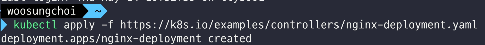
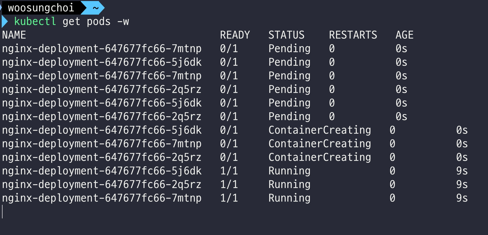
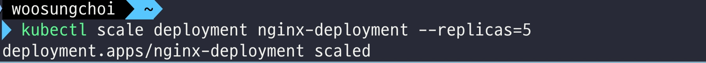
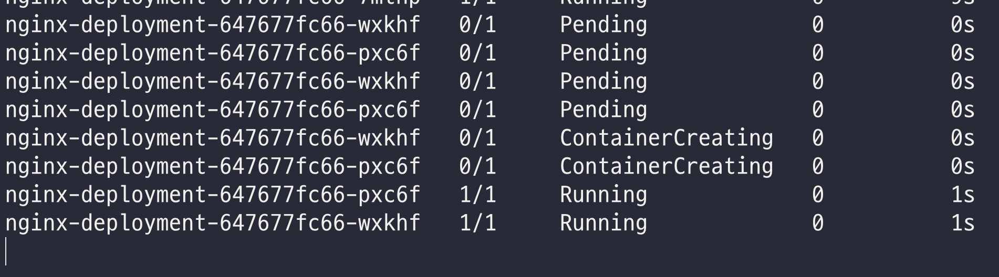
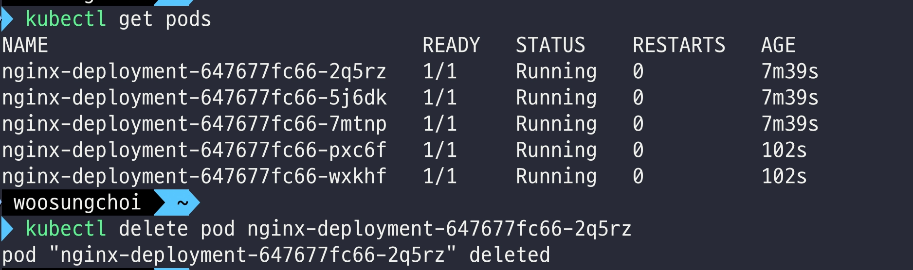
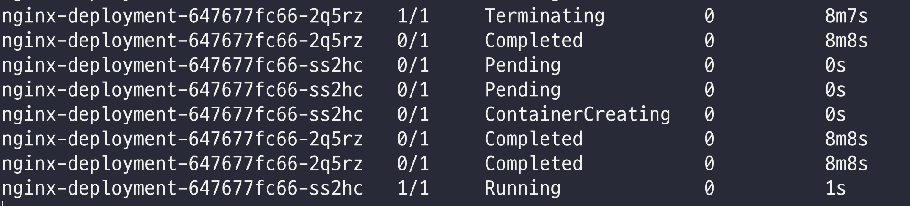

# Week 2

## **키워드들의 포함 관계**

**Controller** (전체 관리자)

- **Informer** (데이터 감시자 - 라이브러리)
    - **Reflector** (실제 API 호출기 - 라이브러리)
        - **Watch** (API 서버에게 통신 요청하는 메서드)
- **WorkQueue** (할 일 목록)
- **Reconciler** (작업 지침서 - 커스텀 가능)
    - **Reconcile()** (핵심 로직 함수)

## Watch

- kube-apiserver에서 제공하는 기능이다.
- controller가 담당하는 리소스에 변화가 생기면 알림을 준다.

알림 전송 방식

- 프로토콜: HTTP/2 streaming
- tcp 연결을 맺은 후에는 클라이언트 측에서 먼저 요청을 하지 않아도 서버에서 원할 때 push가 가능하다
- api server는 etcd 변경 이벤트를 감지하고 controller에게 알림을 push한다

만약 polling 방식이었다면?

- 모든 컨트롤러가 주기적으로 변경사항을 얻기 위해 get 요청을 하게 되고 api server의 부하가 심해진다
- 반면 streaming 방식은 변경이 없는 한 알림을 보내지 않아도 되기 때문에 api server의 부하가 적다

## Informer

컨트롤러가 api server와 효율적으로 통신하기 위해 사용하는 컴포넌트이다.

reconcile 과정에서 리소스 state를 알아야하는데, 이때마다 api server에게 요청을 하게 되면 api server의 부하가 커진다.

- `Reflector`가 가져온 데이터를 내부 메모리에 저장한다.
- `Reflector` 가 제공하는 데이터(DeltaFIFO)로 current state, desired state를 로컬에 복제본 Cache으로 만드는 것이 목적.
- 컨트롤러의 reconciler는 api서버가 아닌 local store에서 데이터를 가져간다.
- 변경 이벤트를 발행해서 workqueue에 넣는다.

## Reflector

- informer의 내부 컴포넌트이다.
- api server에서 변경 사항을 얻어오는 역할을 한다.
- List, Watch api 호출을 담당한다.
- List: 현재 관리중인 리소스의 전체 스냅샷 데이터를 api server에게 요청
- Watch: 변경 사항(Delta)을 실시간으로 감시하기 시작
- 변경 사항을 DeltaFIFO에 넣음.

## reconcile

- Controller에서 호출하는 메서드
- desired state를 유지하는 역할을 한다.
- desired state와 current state의 차이를 계산한다.
- api서버가 아닌 Informer의 local store에서 데이터를 조회한다.
- desired state와 current state가 일치하도록 api server에게 pod 생성, pod 삭제같은 요청을 보낸다.

## Controller

controller에서는 workqueue에서 이벤트를 하나 꺼내서 reconcile 함수를 돌린다.

무한 루프로 reconcile 과정을 반복한다.

여러개의 리소스를 관리해야하기 때문에 고루틴을 통해 병렬로 처리한다.

## 단순화한 코드 구조

```bash
// 1. 최상위: Controller (보통 프레임워크가 관리)
type Controller struct {
    Queue      WorkQueue      // 할 일이 쌓이는 곳
    Informer   Informer       // 데이터를 감시하는 '정보원'
    Reconciler Reconciler     // <- 개발자가 작성한 "그 함수"를 가진 객체
}

// 2. 라이브러리 컴포넌트: Informer (client-go 제공)
type Informer struct {
    // 내부적으로 Reflector를 생성하고 관리함
    reflector  *Reflector     
    cache      Store          // 로컬 데이터 저장소
}

// 3. Informer의 핵심 엔진: Reflector (client-go 제공)
type Reflector struct {
    ListerWatcher  ListerWatcher // List와 Watch API를 호출하는 도구
    store          Store         // 수집한 데이터를 넣을 장소 (Informer의 cache와 연결)
}
```

```bash
// 개발자가 만드는 부분
type MyReconciler struct {
    client.Client
}

func (r *MyReconciler) Reconcile(ctx context.Context, req Request) (Result, error) {
    // 1. 현재 상태를 조회하고 (Informer의 캐시에서 가져옴)
    // 2. 원하는 상태와 비교해서
    // 3. 다르면 액션을 취한다
    return Result{}, nil
}
```

## operator

operator = CRD + custom controller

리소스와 컨트롤러를 커스텀하여 쓸 수 있다.

k8s 내부 리소스 뿐만 아니라 외부 리소스의 desired state도 유지가 가능하다.

Terraform 대신 k8s operator 패턴을 사용하는 경우도 있다고 한다.

---

## 실습

- 실습 환경: 맥북 로컬 환경 + orbstack

### 1-1. Watch로 이벤트 흐름 체감하기

`kubectl get pods -w`

처음 이 커맨드를 실행했을 때는 아무 것도 뜨지 않고 커서만 깜빡거린다.



다른 쪽 터미널에서 deployment로 pod 3개를 띄웠다.



그 후 다음과 같이 알림이 왔다.

deployment를 띄우자 마자 api server에서 알림을 push 한 것으로 보인다.

### 1-2. Desired State 변경 (Scale Out)



기존 설정은 `—replicas=3`이고, `—replicas=5`로 Scale Out 했다.



### 1-3. pod 하나 지워서 desired state 깨기



삭제 후 복구되는 과정



### 1-4. `describe`로 변경 내역 확인

```bash
$ kubectl describe deployment nginx-deployment

Name:                   nginx-deployment
Namespace:              default
CreationTimestamp:      Thu, 14 May 2026 16:37:02 +0900
Labels:                 app=nginx
Annotations:            deployment.kubernetes.io/revision: 1
Selector:               app=nginx
Replicas:               5 desired | 5 updated | 5 total | 5 available | 0 unavailable
StrategyType:           RollingUpdate
MinReadySeconds:        0
RollingUpdateStrategy:  25% max unavailable, 25% max surge
Pod Template:
  Labels:  app=nginx
  Containers:
   nginx:
    Image:         nginx:1.14.2
    Port:          80/TCP
    Host Port:     0/TCP
    Environment:   <none>
    Mounts:        <none>
  Volumes:         <none>
  Node-Selectors:  <none>
  Tolerations:     <none>
Conditions:
  Type           Status  Reason
  ----           ------  ------
  Progressing    True    NewReplicaSetAvailable
  Available      True    MinimumReplicasAvailable
OldReplicaSets:  <none>
NewReplicaSet:   nginx-deployment-647677fc66 (5/5 replicas created)
Events:
  Type    Reason             Age   From                   Message
  ----    ------             ----  ----                   -------
  Normal  ScalingReplicaSet  11m   deployment-controller  Scaled up replica set nginx-deployment-647677fc66 from 0 to 3
  Normal  ScalingReplicaSet  5m3s  deployment-controller  Scaled up replica set nginx-deployment-647677fc66 from 3 to 5
```